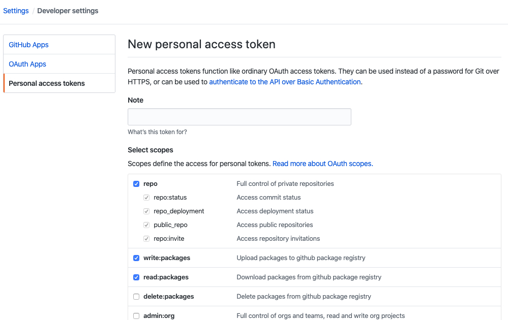
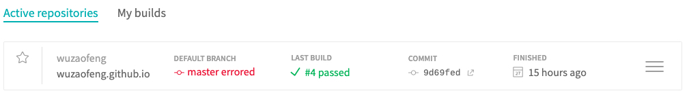
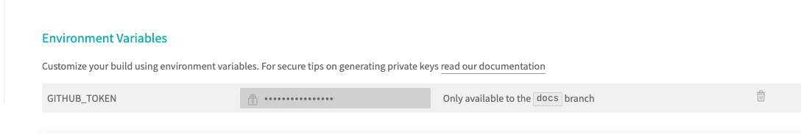
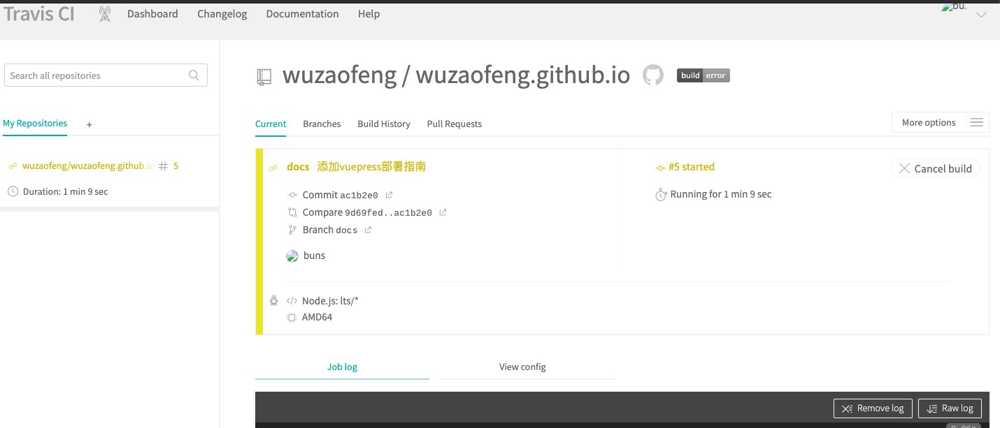

# github.io + VuePress + travis-cl 实现自动化部署静态文档/博客

::: tip 前言
1. github 为您搭建好的服务器，无需自己搭建服务器
2. VuePress 界面十分简洁，并且上手快，能快速的构建整个项目架构
3. travis-cl 可以为您提供自动化部署，只需在本地写好代码，并提交代码，剩下的线上流程全部交与travis实现
4. 本项目使用yarn安装，因为构建安装速度快些
:::


### 为什么采用VuePress
* 内置Markdown 拓展
* 在Markdown 中使用vue
* 多语言配置支持
* 制定配置，主题配置

## 整体思路
1. 在github上创建项目，本地创建并切换到docs分支（开发分支），通过vuePress项目快速构建，添加travis.yml文件，上传到github

2. travis-cl 会自动编译， 安装依赖，并且创建分支到master分支

3. github会将master分支展示web内容

## 操作步骤
1. #### 创建github项目 [username].github.io, 例如我的文档是 wuzaofeng.github.io, 并且拉取到本地，创建自己的docs分支

2. #### 构建vuepress项目
    * 安装 vuepress
    ```
    yarn add -D vuepress
    ```
    * package.json 添加script配置，dev(本地开发)和build(打包到生产)
    ```
    script {
        "dev": "vuepress dev docs",
        "build": "vuepress build docs"
    }
    ```
    * 创建 docs 文件夹，把所有 markdown 文档存放在这里。
    ```
    mkdir docs
    echo '# Hello VuePress!' > docs/README.md
    ```

3. 写一些文档，查看vuepress文档，做一些简单的配置（详情可看文档）

4. 在根目录创建.travis.yml， 特别说明 target_branch原分支为gh-pages， 但github pages需要在master上。
    ```
    language: node_js
    node_js:
        - lts/*
    install:
        - yarn install # npm install
    script:
        - yarn build # 构建
    cache: yarn
    deploy:
        provider: pages
        skip_cleanup: true
        local_dir: docs/.vuepress/dist
        github_token: $GITHUB_TOKEN # 在 GitHub 中生成，用于允许 Travis 向你的仓库推送代码。在 Travis 的项目设置页面进行配置，设置为 secure variable
        keep_history: true
        target_branch: master # 默认设置分支 之前默认：gh-pages
        on:
            branch: docs #  发布的时候使用的branch

    ```
    * node_js 语言选择node
    * install 阶段：安装依赖
    * script 阶段：运行脚本
    * cache 开启缓存
    * deploy 部署
        - local_dir 打包之后的目录，travis-cl会将自动创建分支（master）将打包之后的文件都放在里面
        - github_token 配置github的token, 通过这个向你的仓库推送代码 $GITHUB_TOKEN 环境变量 这块后面会提到
        - target_branch 默认创建的分支名
        - on/branch:
            构建的分支

5. 添加github_token (不是在项目中的Settings, 而是账户的token)
    > Github 增加一个 Personal access tokens，位置在 Settings / Developer settings。



* Note 随意填，填 travis-ci 就行。
* 除了 delete_repo 权限都打勾就行。

6. 提交代码，接下来配置Travis cl 自动化构建

7. 进入[Travis CI](https://travis-ci.org/), 使用github登录， =》进入面板[dashboard](https://travis-ci.org/dashboard) =》 启动刚刚提交的项目，右上角 More options 点击 setting，配置环境变量
* GITHUB_TOKEN  token 是通过上面拿到的




8. 提交代码之后，查看Travis CI面板，会自动构建


she ji