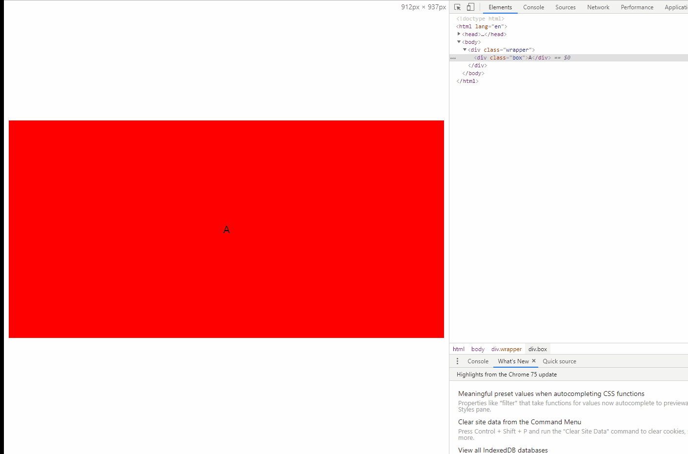
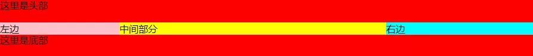
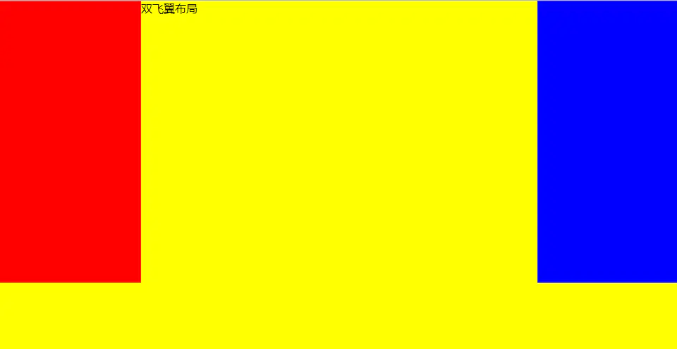

# CSS 面试题

## 扇形怎么画

[扇形实现](https://blog.csdn.net/young_Emily/article/details/80091667)

## flex布局的了解(弹性布局)

当父元素的display设置成flex的时候，就会成一个弹性容器，那么子元素变成了弹性元素，flex分为主轴和侧轴，默认是主轴

### **弹性容器**

* flex-direction(主轴的方向， 默认横向)
* flex-wrap（是否换行，默认不换行）
* flex-flow（direction和wrap的间写）(direction, wrap)
* justify-content(主轴对齐的方式)
* align-items（侧轴的对齐方式）
* align-content (多个主轴线的对齐方式)

### **弹性元素**

* order（顺序排列，数字越小越在前面）（可以负数）
* flex-grow (放大的比例，默认0)
* flex-shrink (缩小的比例， 默认1)
* flex-basis(占据主轴的空间大小，默认auto)
* flex (none | [ <'flex-grow'> <'flex-shrink'>? || <'flex-basis'>)(简写)

* align-self（允许单个元素与其他不对齐）

flex 根据内容剩余空间占据的大小

三等份就是flex: 1, 应该说flex剩余空间比例的大小
如果不设置flex: 1，默认auto，是根据内容的大小伸缩
如果内容多，但还是想三等份（flex: 1就可以了）

[flex](https://developer.mozilla.org/zh-CN/docs/Glossary/Flex)
[阮一峰](http://www.ruanyifeng.com/blog/2015/07/flex-examples.html)

## 盒子模型

盒子模型是指html元素被分成内容content, 内边距padding, 边框 border, 外边距 margin

ie是比较特殊，包括padding和border
标准的是不包含padding和border

[从CSS盒子模型说起](https://juejin.im/post/5965bf105188250da35f11b2#heading-11)

## 请使用css画出一个梯形

```css
/* 三角形 */
.border {
    width: 0;
    height: 0;
    border-top: 50px solid black;
    border-right: 50px solid transparent;
    border-left: 50px solid transparent;
}
/* 梯形(加个宽度即可) */
.border {
    width: 20px;
    height: 0;
    border-top: 50px solid black;
    border-right: 50px solid transparent;
    border-left: 50px solid transparent;
}
```

## 请使用css画出一个半圆,扇形，椭圆都是在border-radius做文章

```css

/* 半圆 */
.border {
    width: 50px;
    height: 25px;
    border-radius: 50px 50px 0 0;
}

/* 扇形 */
.border {
    width: 50px;
    height: 25px;
    border-radius: 0 50px 0 0;
}
```

```css
/* 椭圆 */
.border {
    width: 100px;
    height: 50px;
    border-radius: 50px /25px
}
```

[CSS制作的32种图形效果[梯形|三角|椭圆|平行四边形|菱形|四分之一圆|旗帜]](https://blog.csdn.net/dmtnewtons_blog/article/details/41146485)

## 实现一个三栏布局，中间部分要自适应宽度并且优先加载，左边宽100px右边宽为160px

```html
<div class="wrap">
    <div class="content"></div>
    content
    </div>
    <div class="left">left</div>
    <div class="right">right</div>
</div>
```

```css
/* flex */
.wrap {
    display: flex;
}
.content {
    flex: 1;
    order: 2;
}
.left {
    width: 100px;
    order: 1;
}
.right {
    width: 160px;
    order: 3
}

/* float */
.wrap {
   overflow:hidden;
}
.content {
    display: inline-block;
    width: 100%;
    margin-left: -100px;
    padding-left: 100px;
    box-sizing: border-box;
    margin-right: -160px;
    padding-right: 160px;
}
.left {
    width: 100px;
    float: left;
}
.right {
    width: 160px;
    float: right
}

/* position */
.wrap {
   position: relative
}
.content {
    display: inline-block;
    width: 100%;
    padding-left: 100px;
    box-sizing: border-box;
    padding-right: 160px;
}
.left {
    width: 100px;
    position: absolute;
    left: 0;
    top: 0;
}
.right {
    width: 160px;
    position: absolute;
    right: 0;
    top: 0;
}
```

## div垂直居中，左右10px，高度始终为宽度一半

### 垂直居中用绝对定位，flex, 行高，table方式，主要问题是高度始终是宽度的一半

### 父元素相对定位，padding-bottom: 50%, height: 0

1. padding-bottom相对于宽度width

2. 父元素相对定位，

绝对定位 子元素宽高百分之相对于父元素的`(content + padding)`值, 注意不含`border`

不是绝对定位 标准盒模型下是`content`, IE盒模型是`content+padding+border`

```css
.inner_wrapper{
    background: red;
    position: relative;
    width: 100%;
    height: 0;
    padding-bottom: 50%;
    }
.box{
    position: absolute;
    width: 100%;
    height: 100%;
    display: flex;
    justify-content: center;
    align-items: center;
    font-size: 20px;
}
```

2. 宽度的一半 height: calc(50vw - 10px)



## 圣杯布局



1. 利用flex布局

中间自适应用flex: 1

2. float布局

float:left, float:right

3. 绝对定位布局

中间left: 200px right: 200px

4. 绝对定位 + 相对定位
中间用padding撑开两边
左右绝对定位

5. grid布局

```html
<!DOCTYPE html>
<html lang="en">

<head>
  <meta charset="UTF-8">
  <meta name="viewport" content="width=device-width, initial-scale=1.0">
  <meta http-equiv="X-UA-Compatible" content="ie=edge">
  <title>Document</title>
  <style>
    body{
        display: grid;
    }
    #header{
        background: red;
        grid-row:1;
        grid-column:1/5;
    }

    #left{
        grid-row:2;
        grid-column:1/2;
        background: orange;
    }
    #right{
        grid-row:2;
        grid-column:4/5;
        background: cadetblue;
    }
    #middle{
        grid-row:2;
        grid-column:2/4;
        background: rebeccapurple
    }
    #footer{
        background: gold;
        grid-row:3;
        grid-column:1/5;
    }
  </style>
</head>

<body>
    <div id="header">header</div>
    <div id="left">left</div>
    <div id="middle">middle</div>
    <div id="right">right</div>
    <div id="footer">footer</footer></div>

</body>

</html>
```

## 双飞翼布局



1. 浮动布局

```html
<!DOCTYPE html>
<html lang="en">

<head>
  <meta charset="UTF-8">
  <meta name="viewport" content="width=device-width, initial-scale=1.0">
  <meta http-equiv="X-UA-Compatible" content="ie=edge">
  <title>Document</title>
  <style>
    *{
      margin: 0;
      padding: 0;
    }
    .container {
        min-width: 600px;
    }
    .left {
        float: left;
        width: 200px;
        height: 400px;
        background: red;
        margin-left: -100%;
    }
    .center {
        float: left;
        width: 100%;
        height: 500px;
        background: yellow;
    }
    .center .inner {
        margin: 0 200px; 
    }
    .right {
        float: left;
        width: 200px;
        height: 400px;
        background: blue;
        margin-left: -200px;
    }
  </style>
</head>

<body>
  <article class="container">
    <div class="center">
        <div class="inner">双飞翼布局</div>
    </div>
    <div class="left"></div>
    <div class="right"></div>
</article>
</body>

</html>
```

2.绝对定位

## 什么是BFC？什么条件下会触发？渲染规则？应用场景有哪些？

1. 什么是BFC
浮动元素和绝对定位元素，非块级盒子的块级容器（例如 inline-blocks, table-cells, 和 table-captions），以及overflow值不为"visiable"的块级盒子，都会为他们的内容创建新的BFC（Block Fromatting Context， 即块级格式上下文）

2. 触发条件

* **根元素**
* **浮动元素**
* **绝对定位**
* **行内块元素**（元素的 display 为 inline-block）
* **表格**相关的（元素的 display为 table-cell， display 为 table-caption， display为 table、table-row、 table-row-group、table-header-group、table-footer-group（分别是HTML table、row、tbody、thead、tfoot的默认属性）或 inline-table）
* **overflow 值不为 visible** 的块元素 -弹性元素（display为 flex 或 inline-flex元素的直接子元素
* **网格元素**（display为 grid 或 inline-grid 元素的直接子元素

3.BFC渲染规则

BFC是一个**独立的容器**，外面的元素不会影响里面的元素

BFC垂直方向**边距重叠**

BFC的区域**不会与浮动元素的box重叠**
