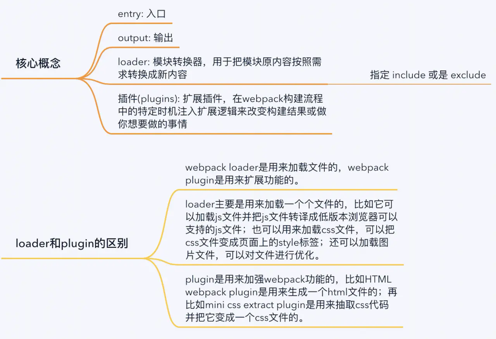

# 工程类面试题

## 如何优化代码

1. 降低代码的**解偶性**

2. 提高函数的**复用**

3. **分离文件**

4. 纯函数

5. 添加代码注释

**对浏览器请求优化**

1. 添加雪碧图

2. 减少http请求数

3. 预加载，懒加载图片

4. 图片小的可以采用base64

5. js放入body后面，css放在顶部，css和js引用外部文件

6. 采用CDN

[优秀前端必知的话题：我们应该做些力所能及的优化](https://juejin.im/post/5bbc1b0c6fb9a05cf230140c)

[Web 研发模式演变 玉伯](https://github.com/lifesinger/lifesinger.github.com/issues/184)

[前后端分离的优缺点](https://www.cnblogs.com/wx-yy/p/10264317.html)

## 如何有效的二次封装

一般二次封装是为了更加灵活，为以后的修改更加便捷，易读，可扩展。

比如说我封装分页组件。如果不用封装多一层，会每个页面都引用该分页，那么当需要统一改分页的时候，带动的文件非常的多，而且有可能不小心改漏文件

如果统一管理，就不会有这个问题

## 前后端分离的优势和劣势

优势

1. 最大的好处就是前端可以通过js做大量的处理，http请求可以通过nginx转发，**减少服务器的压力**

2. 以前是jsp，前端代码和后端代码杂糅在一起，现在两边代码真正的解耦

3. 前后端职责很清晰， 分工明确， 提升开发效率

4. 部署相对独立

劣势

1. 代码不能复用

2. 全异步，对 SEO 不利

[为什么要前后端分离？有什么优缺点？(转)](https://www.cnblogs.com/651434092qq/p/11309535.html)

[实践中的前后端分离](https://juejin.im/post/59dad63ff265da065270d49e)

## webpack3 和 webpack4区别

1. mode

webpack增加了一个**mode配置**，只有两种值development | production。对不同的环境他会启用不同的配置。

2. CommonsChunkPlugin

**CommonChunksPlugin**已经从webpack4中移除。
可使用optimization.splitChunks进行模块划分（提取公用代码）。
但是需要注意一个问题，默认配置只会对异步请求的模块进行提取拆分，如果要对entry进行拆分
需要设置optimization.splitChunks.chunks = 'all'。

3. webpack4使用**MiniCssExtractPlugin**取代**ExtractTextWebpackPlugin**。

4. 代码分割。

使用**动态import**，而不是用system.import或者require.ensure

5. vue-loader。

使用vue-loader插件为.vue文件中的各部分使用相对应的loader，比如css-loader等

6. UglifyJsPlugin

现在也不需要使用这个plugin了，只需要使用optimization.minimize为true就行，production mode下面自动为true

7. optimization.minimizer可以配置你自己的压缩程序

## 当页面卡顿的时候

应该分析浏览器页面的请求，加载顺序，分析那个接口比较慢

再分析代码逻辑

## 性能上有什么优化

其实的在项目上都有做这些优化，只是可能觉得太常识了
[前端性能优化总结](https://segmentfault.com/a/1190000017556203)

## 如果图片列表全部都显示优化

图片多的话，可以考虑用懒加载，下拉加载，分屏加载，缩略图

[web前端优化之图片优化](https://juejin.im/post/59a7725b6fb9a02497170459)

## 现在要你完成一个Dialog组件，说说你设计的思路？它应该有什么功能？

1. 该组件需要提供hook指定渲染位置，默认渲染在body下面。
2. 然后改组件可以指定外层样式，如宽度等
3. 组件外层还需要一层mask来遮住底层内容，点击mask可以执行传进来的onCancel函数关闭Dialog。
4. 另外组件是可控的，需要外层传入visible表示是否可见。
5. 然后Dialog可能需要自定义头head和底部footer，默认有头部和底部，底部有一个确认按钮和取消按钮，确认按钮会执行外部传进来的onOk事件，然后取消按钮会执行外部传进来的onCancel事件。
7. 当组件的visible为true时候，设置body的overflow为hidden，隐藏body的滚动条，反之显示滚动条。
8. 组件高度可能大于页面高度，组件内部需要滚动条。
9. 只有组件的visible有变化且为true时候，才重渲染组件内的所有内容。

## webpack中loaders作用？plugins和loaders区别？是否写过webpack插件

## 项目

1.微信授权
2.换肤功能
3.性能优化
