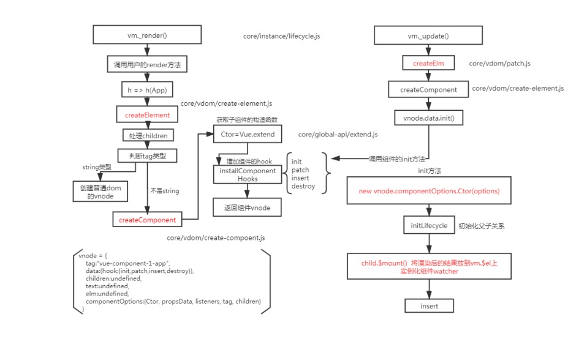

# vue相关的面试题

## 1. 谈一下你对MVVM原理的理解


说起`MVVM`, 那么就要说下以前的`MVC`模式，`MVC`模式，指的是用户在界面操作时，会请求服务器路由，路由会调用对应的控制器来处理，控制器会拿到数据之后，再返回给前端，页面重新渲染

MVVM: 传统的前端会通过操作dom，将数据渲染在页面上， 但MVVM不同， v就是视图，M就是数据，而VM, 就是vue内部帮我们实现了数据渲染操作，通过数据来驱动视图， 当数据有更新变化的时候，vue会自动的通知视图层更新数据（双向数据绑定）

## 2. 请说一下响应式数据的原理？


vue是通过`Object.defineProperty`，数据劫持来实现响应式数据的。当vue初始化数据的时候，会将data里面的数据通过setter, getter, 来劫持数据，
当对应属性，进行依赖收集到当前组件的watcher(渲染类型watcher), 当数据发生变化的时候，会通过watcher通知相关依赖进行更新。

```
// core/observer/index  defineReactive方法中
Object.defineProperty(obj, key, {
    enumerable: true,
    configurable: true,
    get: function reactiveGetter () {
      const value = getter ? getter.call(obj) : val
      if (Dep.target) {
        dep.depend() /* 收集依赖 */
        if (childOb) {
          childOb.dep.depend()
          if (Array.isArray(value)) {
            dependArray(value)
          }
        }
      }
      return value
    },
    set: function reactiveSetter (newVal) {
      const value = getter ? getter.call(obj) : val
      if (newVal === value || (newVal !== newVal && value !== value)) {
        return
      }
      if (process.env.NODE_ENV !== 'production' && customSetter) {
        customSetter()
      }
      if (getter && !setter) return
      if (setter) {
        setter.call(obj, newVal)
      } else {
        val = newVal
      }
      childOb = !shallow && observe(newVal)
      dep.notify() /**通知相关依赖进行更新**/
    }
  })
```

## 3.Vue中是如何检测数组变化?

* Vue是采用函数劫持的方式，来重写数组方法的
* Vue将data中的数组，**通过原型链来重写**，指向自己自定义的数组原型方法。当调用数组的api时，会调用自己定义的方法，从而检测数组变化


```
// core/observer/array
const arrayProto = Array.prototype
export const arrayMethods = Object.create(arrayProto)

const methodsToPatch = [
  'push',
  'pop',
  'shift',
  'unshift',
  'splice',
  'sort',
  'reverse'
]

/**
 * Intercept mutating methods and emit events
 */
methodsToPatch.forEach(function (method) { // 重写原型方法
  // cache original method
  const original = arrayProto[method] // 调用原数组的方法
  def(arrayMethods, method, function mutator (...args) {
    const result = original.apply(this, args)
    const ob = this.__ob__
    let inserted
    switch (method) {
      case 'push':
      case 'unshift':
        inserted = args
        break
      case 'splice':
        inserted = args.slice(2)
        break
    }
    if (inserted) ob.observeArray(inserted)
    // notify change
    ob.dep.notify() // 当调用数组方法后，手动通知视图更新
    return result
  })
})
```

## 4.为何Vue采用异步渲染?

理解：因为如果不采用异步更新，那么每次更新数据都会对当前组件进行**重新渲染**.所以为了**性能考虑**。 Vue
会在本轮数据更新后，再去异步更新视图!


```
// core/observer/watcher
  update () {
    /* istanbul ignore else */
    if (this.lazy) {
      this.dirty = true
    } else if (this.sync) {
      this.run()
    } else {
      queueWatcher(this)
    }
  }

// core/observer/scheduler
export function queueWatcher (watcher: Watcher) {
  const id = watcher.id
  if (has[id] == null) {
    has[id] = true
    if (!flushing) {
      queue.push(watcher)
    } else {
      // if already flushing, splice the watcher based on its id
      // if already past its id, it will be run next immediately.
      let i = queue.length - 1
      while (i > index && queue[i].id > watcher.id) {
        i--
      }
      queue.splice(i + 1, 0, watcher)
    }
    // queue the flush
    if (!waiting) {
      waiting = true

      if (process.env.NODE_ENV !== 'production' && !config.async) {
        flushSchedulerQueue()
        return
      }
      nextTick(flushSchedulerQueue)
    }
  }
}
```

## 5.nextTick实现原理?

nextTick主要采用的是宏任务和微任务，通过定义一个异步方法，当多次调用nextTick的时候，会将回调函数通过数组的形式插入到队列中


```
// core/util/next-ticks
// 定义个异步方法
let timerFunc
if (typeof Promise !== 'undefined' && isNative(Promise)) {
  const p = Promise.resolve()
  timerFunc = () => {
    p.then(flushCallbacks)
    if (isIOS) setTimeout(noop)
  }
} else if (!isIE && typeof MutationObserver !== 'undefined' && (
  isNative(MutationObserver) ||
  // PhantomJS and iOS 7.x
  MutationObserver.toString() === '[object MutationObserverConstructor]'
)) {
  // Use MutationObserver where native Promise is not available,
  // e.g. PhantomJS, iOS7, Android 4.4
  // (#6466 MutationObserver is unreliable in IE11)
  let counter = 1
  const observer = new MutationObserver(flushCallbacks)
  const textNode = document.createTextNode(String(counter))
  observer.observe(textNode, {
    characterData: true
  })
  timerFunc = () => {
    counter = (counter + 1) % 2
    textNode.data = String(counter)
  }
} else if (typeof setImmediate !== 'undefined' && isNative(setImmediate)) {
  // Fallback to setImmediate.
  // Techinically it leverages the (macro) task queue,
  // but it is still a better choice than setTimeout.
  timerFunc = () => {
    setImmediate(flushCallbacks)
  }
} else {
  // Fallback to setTimeout.
  timerFunc = () => {
    setTimeout(flushCallbacks, 0)
  }
}

// nextTick实现
export function nextTick (cb?: Function, ctx?: Object) {
  let _resolve
  callbacks.push(() => {
    if (cb) {
      try {
        cb.call(ctx)
      } catch (e) {
        handleError(e, ctx, 'nextTick')
      }
    } else if (_resolve) {
      _resolve(ctx)
    }
  })
  if (!pending) {
    pending = true
    timerFunc() // 执行异步方法
  }
  // $flow-disable-line
  if (!cb && typeof Promise !== 'undefined') {
    return new Promise(resolve => {
      _resolve = resolve
    })
  }
}

```

## 6. Vue中Computed的特点

Computed也是一个watcher，但他具有缓存，只有依赖的属性发生变化的时候，才会更新视图


```
// core/instance/state
function initComputed (vm: Component, computed: Object) {
  // $flow-disable-line
  const watchers = vm._computedWatchers = Object.create(null)
  // computed properties are just getters during SSR
  const isSSR = isServerRendering()

  for (const key in computed) {
    const userDef = computed[key]
    const getter = typeof userDef === 'function' ? userDef : userDef.get
    if (process.env.NODE_ENV !== 'production' && getter == null) {
      warn(
        `Getter is missing for computed property "${key}".`,
        vm
      )
    }

    if (!isSSR) {
      // create internal watcher for the computed property.
      watchers[key] = new Watcher(
        vm,
        getter || noop,
        noop,
        computedWatcherOptions
      )
    }

    // component-defined computed properties are already defined on the
    // component prototype. We only need to define computed properties defined
    // at instantiation here.
    if (!(key in vm)) {
      defineComputed(vm, key, userDef)
    } else if (process.env.NODE_ENV !== 'production') {
      if (key in vm.$data) {
        warn(`The computed property "${key}" is already defined in data.`, vm)
      } else if (vm.$options.props && key in vm.$options.props) {
        warn(`The computed property "${key}" is already defined as a prop.`, vm)
      }
    }
  }
}

function createComputedGetter (key) {
  return function computedGetter () {
    const watcher = this._computedWatchers && this._computedWatchers[key]
    if (watcher) {
      if (watcher.dirty) { // 如果依赖的值没发生变化,就不会重新求值
        watcher.evaluate()
      }
      if (Dep.target) {
        watcher.depend()
      }
      return watcher.value
    }
  }
}
```

## 7.Watch中的deep:true 是如何实现的

当用户指定了 watch 中的deep属性为 true 时，如果当前监控的值是对象类型。会对对象中的每一项进行求值，此时会将当前 watcher 存入到对应属性的依赖中，这样数组中对象发生变化时也会通知数据更新

```
core/observer/watcher

get () {
    pushTarget(this)
    let value
    const vm = this.vm
    try {
      value = this.getter.call(vm, vm)
    } catch (e) {
      if (this.user) {
        handleError(e, vm, `getter for watcher "${this.expression}"`)
      } else {
        throw e
      }
    } finally {
      // "touch" every property so they are all tracked as
      // dependencies for deep watching
      if (this.deep) {
        traverse(value)
      }
      popTarget()
      this.cleanupDeps()
    }
    return value
  }

core/observer/traverse

function _traverse (val: any, seen: SimpleSet) {
  let i, keys
  const isA = Array.isArray(val)
  if ((!isA && !isObject(val)) || Object.isFrozen(val) || val instanceof VNode) {
    return
  }
  if (val.__ob__) {
    const depId = val.__ob__.dep.id
    if (seen.has(depId)) {
      return
    }
    seen.add(depId)
  }
  if (isA) {
    i = val.length
    while (i--) _traverse(val[i], seen)
  } else {
    keys = Object.keys(val)
    i = keys.length
    while (i--) _traverse(val[keys[i]], seen)
  }
}
```

## 8.Vue组件的生命周期

* `beforeCreate` 在实例初始化之后，数据观测(data observer) 之前被调用
* `created` 实例已经创建完成之后被调用。在这一步，实例已完成以下的配置：

数据观测(data observer)，属性和方法的运算， watch/event 事件回调。这里没有$el

* `beforeMount` 在挂载开始之前被调用：相关的 render 函数首次被调用

* `mounted`  el 被新创建的 vm.$el 替换，并挂载到实例上去之后调用该钩子

* `beforeUpdate` 数据更新时调用，发生在虚拟 DOM 重新渲染和打补丁之前

* `updated` 由于数据更改导致的虚拟 DOM 重新渲染和打补丁，在这之后会调用该钩子

* `beforeDestroy` 实例销毁之前调用。在这一步，实例仍然完全可用

* `destroyed`  实例销毁后调用。调用后， Vue 实例指示的所有东西都会解绑定，所有的事件
监听器会被移除，所有的子实例也会被销毁。 该钩子在服务器端渲染期间不被调用

**要掌握每个生命周期内部可以做什么事**

* `created` 实例已经创建完成，因为它是最早触发的原因可以进行一些数据，资源的请求

* `mounted` 实例已经挂载完成，可以进行一些DOM操作

* `beforeUpdate` 可以在这个钩子中进一步地更改状态，这不会触发附加的重渲染过程。

* `updated` 可以执行依赖于 DOM 的操作。然而在大多数情况下，你应该避免在此期间更改状态，因为这可能会导致更新无限循环。 该钩子在服务器端渲染期间不被调用。

* `destroyed` 可以执行一些优化操作,清空定时器，解除绑定事件


## 9.v-for与v-if为何不能连用

v-for优先于v-if, 如果连用的话，那么v-for先执行，之后再判断v-if，这样性能这块非常的低
所以一般用v-if放入外层的template

## 10.diff算法的时间复杂度

两个树的完全的 diff 算法是一个时间复杂度为 O(n3) , Vue 进行了优化·O(n3) 复杂度的问题转换成 O(n) 复杂度的问题(只比较同级不考虑跨级问题) 在前端当中， 你很少会跨越层级地移动Dom元素。 所 以 Virtual Dom只会对同一个层级的元素进行对比。

## 11.简述Vue中diff算法原理

* 1.先同级比较，在比较子节点

* 2.先判断一方有子节点一方没子节点的情况

* 3.比较都有子节点的情况, 递归比较子节点

## 12.v-for中为什么要使用key

key是**需要唯一标识**，而且是**不可变的**，防止后续修改删除列表的时候造成bug
vue对通过diff算法，**复用原则**，判断两个dom节点是否一样，如果一样的话会复用原来的dom节点
key不能是index，不然也会有同样问题。

如果**静态列表的话，就没有删除修改操作**，也就index是唯一标识，就不会有问题


[参考链接](./class.pdf)

## 13. 描述组件渲染和更新过程

组件渲染的时候，通过**render函数**生成虚拟节点，再调用`vue.extends`方法来**构建子组件的构造函数**，并且实例化，最后调用`$mount()`方法挂载在页面上。
更新的时候，使用的是diff算法比对节点



## 14. 组件中的 data为什么是一个函数?，为什么new Vue的data可以放对象

1. 避免同一组件，创建多次实例，而实例使用的同一个构造函数，实例的数据互相影响，保持数据的独立性

2. 什么时候用new Vue，这个是在main.js，根组件实例的时候就一样，我们写项目的时候就只有一个实例

## 15.vue中事件绑定的原理

1. 原生dom的事件绑定， 原生事件
2. 组件的自定义事件

## 16.v-model中的实现原理及如何自定义v-model

1. 原生的 v-model ，会根据标签的不同生成不同的事件和属性
2. 组件的v-model 就是value+input的语法糖

自定义v-model
```
Vue.component('el-checkbox',{
  template:`<input type="checkbox" :checked="check"
  @change="$emit('change',$event.target.checked)">`,
  model:{
    prop:'check', // 更改默认的value的名字
    event:'change' // 更改默认的input方法名
  },
  props: { check: Boolean }
})
```

## 17.Vue中v-html会导致哪些问题

1. 可能会导致 xss 攻击
2. v-html 会替换掉标签内部的子元素
3. 样式需要通过deep来添加scoped

## 18.Vue父子组件生命周期调用顺序

组件的调用顺序都是先父后子,渲染完成的顺序肯定是先子后父

组件的销毁时是先父后子，销毁完成的顺序是先子后父

**同步**

**加载渲染过程**

父beforeCreate->父created->父beforeMount->子beforeCreate->子created->子beforeMount- >子mounted->父mounted

**异步**

父beforeCreate->父created->父beforeMount->父mounted->子beforeCreate->子created->子beforeMount- >子mounted

**子组件更新过程**

父beforeUpdate->子beforeUpdate->子updated->父updated

**父组件更新过程**

父beforeUpdate->父updated

**销毁过程**

父beforeDestroy->子beforeDestroy->子destroyed->父destroyed

## 19.Vue组件如何通信? 单向数据流

* 父子间通信 父->子通过 `props` 、子-> 父 `$on、$emit` (发布订阅)
* 获取父子组件实例的方式 `$parent、$children`
* 在父组件中提供数据子组件进行消费 `Provide、inject` 插件
* `Ref` 获取实例的方式调用组件的属性或者方法(如果给dom写，获取dom元素，如果给组件写，就获取组件的实例)
* `Event Bus` 实现跨组件通信 Vue.prototype.$bus = new Vue(公共的实例)
* `Vuex` 状态管理实现通信 $attrs $listeners

## 20. Vue中相同逻辑如何抽离？

Vue.mixin 用法 给组件每个生命周期，函数等都混入一些公共逻辑

mixin使用的时候，找不到根源，就是看实例的时候就莫名多个数据

## 21.为什么要使用异步组件？

如果组件功能多，打包容量会特别大，需要采用异步组件，主要依赖于import()语法，可以实现文件按需加载

组件的定义，变成函数

## 22.什么是作用域插槽

**插槽**

```
子组件
<app><div slot="a">xxxx</div><div slot="b">xxxx</div></app>
父组件
slot name="a" slot name="b"
```
创建**组件虚拟节点**时候，遇到插槽slot属性，进行分类
**渲染组件**时，拿对应的slot属性的节点进行替换操作（插槽的作用域为父组件）

替换的过程，将父组件设置插槽的节点，设置到对应子组件的插槽里

作用域插槽（作用域在子组件）
子组件的数据，提供给父组件调用

初始化的时候不会渲染slot的子节点，用一个函数存起来
当调用的时候，才执行这个函数

## 23.谈谈你对 keep-alive 的了解？

keep-alive 可以实现组件的缓存作用
2个属性 include / exclude
2个生命周期 activated , deactivated

keep-alive是取第一个组件

用了rlu方法，当超出缓存最长个数时，会将最早缓存删掉

## 24. Vue中常见性能优化

1. 编码优化

* 不要将所有的数据都放在data中，可以放在computed， 定时器可以不放data
* vue 在 v-for 时给每项元素绑定事件需要用**事件代理**
* SPA 页面采用keep-alive缓存组件
* 拆分组件( 提高复用性、增加代码的可维护性,减少不必要的渲染)
* key 保证唯一性
* 合理使用路由懒加载、异步组件
* 数据持久化的问题 （防抖、节流）
* 合理使用v-if和v-show
* Object.freeze 冻结数据
* 尽量采用runtime运行时版本

2. Vue 加载性能优化:

* 图片懒加载 (https://github.com/hilongjw/vue-lazyload.git)
* 第三方模块按需导入 (babel-plugin-component)
* 滚动到可视区域动态加载 (https://tangbc.github.io/vue-virtual-scroll-list)

3. 用户体验

* app-skeleton 骨架屏
* app-shell app壳
* pwa serviceworker

4. SEO 优化：
* 预渲染插件 prerender-spa-plugin
* 服务端渲染 ssr

5. 打包优化:

* 使用 cdn 的方式加载第三方模块
* 多线程打包 happypack
* splitChunks 抽离公共文件
* sourceMap 生成

6. 缓存，压缩

* 客户端缓存、服务端缓存
* 服务端 gzip 压缩

## 25. Vue3.0你知道有哪些改进?

* Vue3 采用了TS来编写
* 支持 Composition API， 解决代码的条理性，mixins混乱问题，
* Vue3 中响应式数据原理改成 proxy
* vdom 的对比算法更新，只更新 vdom 的绑定了动态数据的部分

## 26. 实现hash路由和history路由

* onhashchange #
* history.pushState h5 api， 页面不存在的问题，所以通过服务端可以解决

(bilibili vue面试题)[https://www.bilibili.com/video/av90955610?from=search&seid=4442674282775134142]