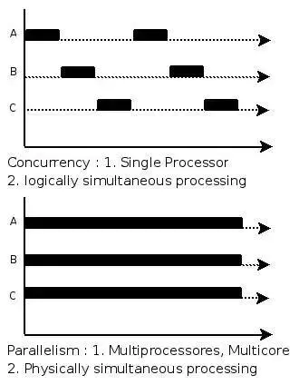

# 前端面试之道的理解

## JS 异步编程及常考面试题

### 并发(Concurrency)与并行(Parallelism)的区别

并发是比如两个任务A, B, **同一时间段**通过**切换**来完成任务

并行是比如两个任务A, B, 同一时间点同时并行完成任务，A,B 互不影响

::: tip 相关链接
[漫话：如何给女朋友解释什么是并发和并行](https://juejin.im/post/5bdf0667e51d450b267fe3e3)
:::

### 
