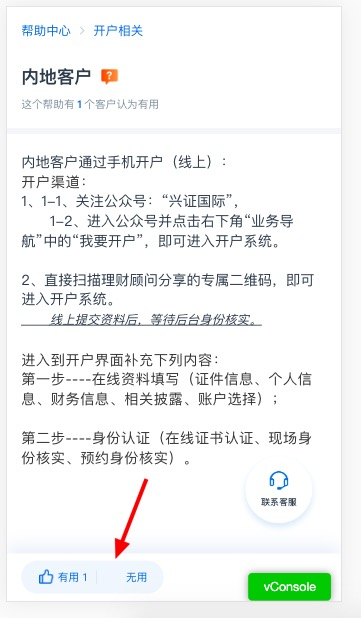
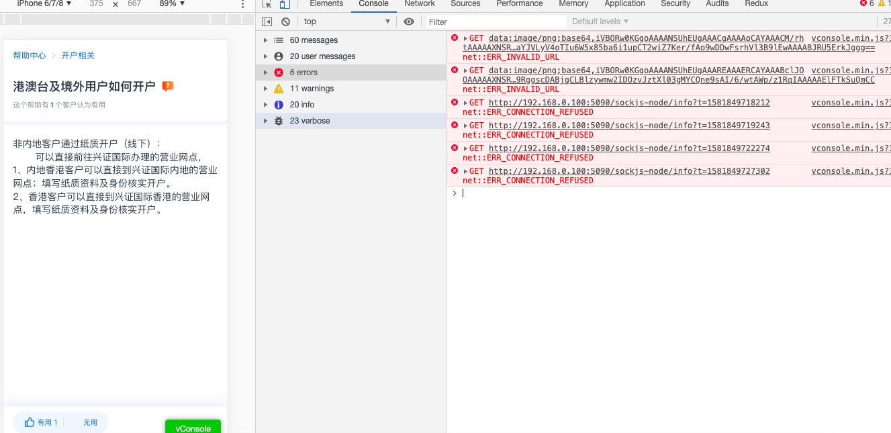
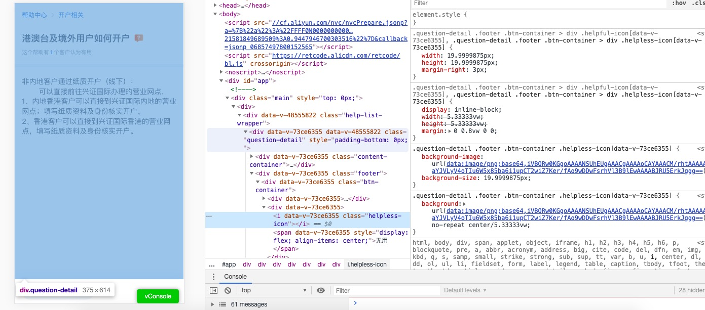
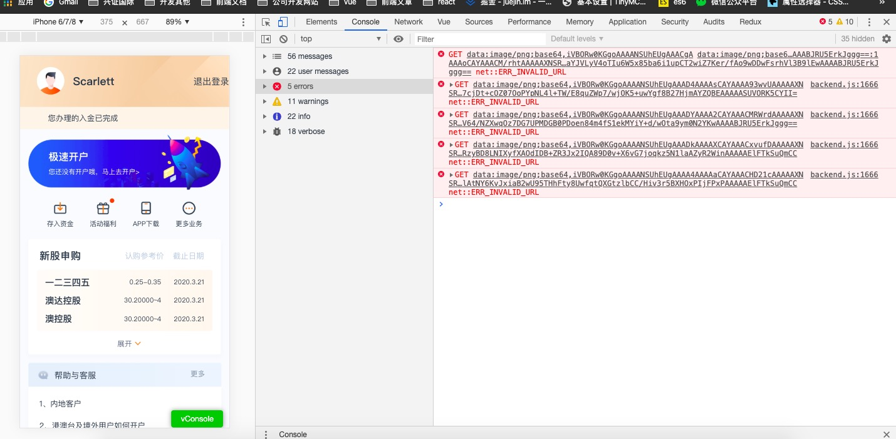
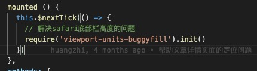
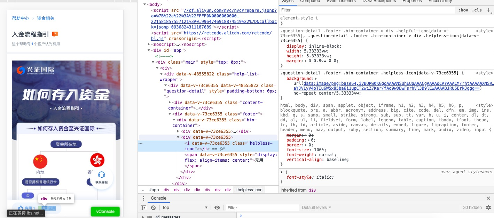

# 网厅首页开发问题笔记

遇到了个很奇怪的问题，我完美的开发完成首页，点击帮助中心之后，再点返回之后，所在的图标有些显示，有些没有显示

**正常的效果图**

## bug 复现

返回

## 问题原因

**console.log报错**

**查看样式**

## 分析思路

1. 由于文章详情是另一个同事做的，而首页是我做的，先查看**自己代码**是否有问题，排查自己代码。
经过一顿检查，只有跳转到文章详情，才有问题，而跳转到入金页面，其他页面，返回都没问题

2. 确定是文章详情页面有问题
通过`postcss-px-to-viewport`插件，转成vw, 又转回px，base64读取失败

**问题原因**
引入 `viewport-units-buggyfill` 插件所致

[viewport-units-buggyfill](https://www.imcyk.com/post/136.html)

3. 注释掉这个插件，问题解决了

4. 问题解决了，之前为了引用插件， 解决safari底部栏高度的问题

5. 我看了一下代码，而且去除这个插件，之后发现，当内容少的时候， safari浏览器会出现个滚动条，而其他浏览器不会

6. 看了一下样式 100vh 影响的

相关链接 https://segmentfault.com/q/1010000020155101

7. 之前滚动条出现的原因，在于内容比较少的时候，但使用 100vh， safari浏览器上还是会超出滚动条

`calc(100vh-35px)`
使用100vh的原因，是想计算除了底部的高度，那么可以换一个写法，只要内容加个 `padding-bottom:35px` 就可以解决这个问题
