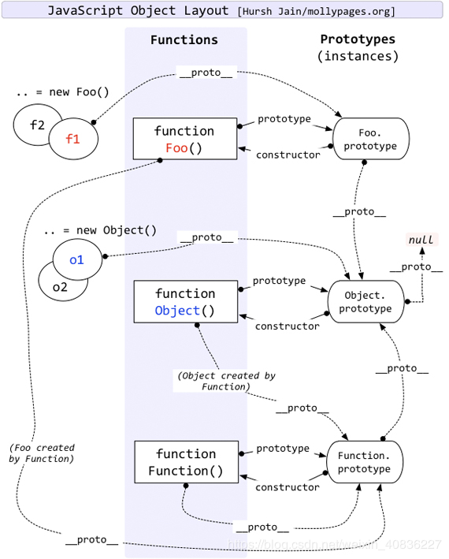

## 原型以及原型链

### 原型

本质是一个js对象(除了`null`)，当我们通过**构造函数**创建**实例**的时候，构造函数的其中一个属性`prototype`指向**原型**，**实例**的`_proto_`指向**原型**

实例对象与原型对象之间通过`_proto_`来关联起来，当实例的属性找不到的时候会通过`_proto`继续往上层原型对象查找，直到找到`Object.prototype`为止

用于创建出来的实例共享属性以及方法

### 原型链

**原型链**是通过实例的`_proto`属性，查找原型对象，如果找不到，会往上查找。这样成为一个原型链，一般是用于继承

关于Function__proto__===Function.prototype的问题

[从探究Function.__proto__===Function.prototype过程中的一些收获](https://github.com/jawil/blog/issues/13)



## 作用域

js是**词法作用域**，也就是**静态作用域**

**静态作用域**是，函数作用域在**(函数定义)**的时候就决定了 (该作用域是父级创建的所以作用域链)

**动态作用域**是，函数作用域在**函数调用**的时候才决定的。

### 个人理解作用域

作用域有两种

一种是函数创建的时候，会有个**静态作用域**，静态作用域是指将父级或父级以上的作用域的所有变量对象，可以理解成一个**父级的作用域链**

第二种，就是函数执行的时候，会创建一个执行上下文，也就是会创建一个作用域，是函数独有的作用域，两者加起来就是该函数整体的作用域


## 执行上下文

js引擎执行代码时会创建执行环境（执行上下文）

* 创建全局函数

* 函数执行

* eval方法调用

### 生命周期

创建阶段
在这个阶段中，执行上下文会分别创建变量对象，建立作用域链，以及确定this的指向。

代码执行阶段
创建完成之后，就会开始执行代码，这个时候，会完成变量赋值，函数引用，以及执行其他代码

### **执行上下文都会包含三个重要属性**

1. 变量对象（variable Object VO）

2. 作用域链（scoped chain）

3. this

#### 变量对象(VO)

1. 函数的所有形参（如果是函数上下文）

    * 由**名称和对应值**组成的一个变量对象的属性被创建

    * 没有实参，为undefined

2. 函数声明

    * 由**名称和对应值**（函数对象(function-object)）组成一个变量对象的属性被创建

    * 如果变量对象已经存在相同名称的属性，则**完全替换**这个属性

3. 变量声明

    * 由**名称和对应值**（undefined）组成一个变量对象的属性被创建；

    * 如果变量名称跟已经声明的形式参数或函数相同，则变量声明**不会干扰**已经存在的这类属性

#####  变量对象（VO）与活动对象（AO）区别

当每次执行上下文之前，会保存上下文定义的属性以及函数声明, 该阶段是不可访问

但执行阶段之后，变量对象（VO）会转成 活动对象（AO）,里面的属性可以访问

本质上都是同一个对象，区别在于运行不同的对象周期

[JavaScript深入之作用域链 ](https://github.com/mqyqingfeng/Blog/issues/6)

::: tip 总结

1. 全局上下文的**变量对象**初始化是全局对象 (window)

2. 函数上下文的**变量对象**初始化只包括 Arguments 对象

3. 在进入执行上下文时会给变量对象添加形参、函数声明、变量声明等初始的属性值

4. 在代码执行阶段，会再次修改变量对象的属性值

:::

## this

### 从ECMAScript规范

判断this

1. 计算 `MemberExpression` 的结果赋值给 `ref`
`MemberExpression` 左边表达式

2. 判断 `ref` 是不是一个 `Reference` 类型。

```
2.1 如果 ref 是 Reference，并且 IsPropertyReference(ref) 是 true, 那么 this 的值为 GetBase(ref)

2.2 如果 ref 是 Reference，并且 base value 值是 Environment Record, 那么this的值为 ImplicitThisValue(ref)

2.3 如果 ref 不是 Reference，那么 this 的值为 undefined
```

由于不是严格模式，this如果是undefined，会指向全局对象window

[JavaScript深入之从ECMAScript规范解读this](https://github.com/mqyqingfeng/Blog/issues/7)

### 常规理解

this就是最后调用他的函数，

1. 直接调用 window （window 绑定）

2. 对象调用指向对象 （隐式绑定）

3. new 调用指向实例 （new 绑定）

4. 可以通过call， apply, bind改变（显式绑定）

```
1. 查看函数在哪被调用。
2. 左侧有没有对象？如果有，它就是 “this” 的引用。如果没有，继续第 3 步。
3. 该函数是不是用 “call”、“apply” 或者 “bind” 调用的？如果是，它会显式地指明 “this” 的引用。如果不是，继续第 4 步。
4. 该函数是不是用 “new” 调用的？如果是，“this” 指向的就是 JavaScript 解释器新创建的对象。如果不是，继续第 5 步。
5. 是否在“严格模式”下？如果是，“this” 就是 undefined，如果不是，继续第 6 步。
6. JavaScript 很奇怪，“this” 会指向 “window” 对象。
```

## 闭包

指那些能够访问自由变量的函数

1. 创建它的执行上下文被销毁了，但它仍然存在（比如内部函数从父函数返回过来）

2. 在代码中引用了自由变量

因为闭包能访问以及销毁它但执行上下文访问到变量。而这个变量是无法被销毁的，存储在内存中。
<!-- 1. 闭包是外部访问局部变量的函数 -->
<!-- ```
function aaa () {
    window.a = function () {
        aaa
    }
}
``` -->

## 参数按值传递

参数传递都是按值来传递的，但是js中有分``基本类型和引用类型``，所说的值传递是指栈中的值拷贝

基本类型是存储在栈内存中，但引用类型是将地址存在栈内存中，而数据存在堆内存中