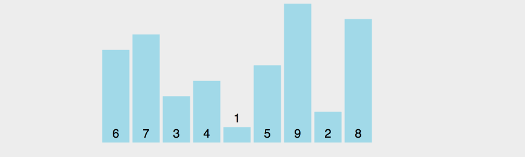

## 原型以及原型链

### 原型

本质是一个js对象(除了`null`)，当我们通过**构造函数**创建**实例**的时候，构造函数的其中一个属性`prototype`指向**原型**，**实例**的`_proto_`指向**原型**

实例对象与原型对象之间通过`_proto_`来关联起来，当实例的属性找不到的时候会通过`_proto`继续往上层原型对象查找，直到找到`Object.prototype`为止

用于创建出来的实例共享属性以及方法

### 原型链

**原型链**是通过实例的`_proto`属性，查找原型对象，如果找不到，会往上查找。这样成为一个原型链，一般是用于继承

关于Function__proto__===Function.prototype的问题

[从探究Function.__proto__===Function.prototype过程中的一些收获](https://github.com/jawil/blog/issues/13)


## 作用域

js是**词法作用域**，也就是**静态作用域**

**静态作用域**是，函数作用域在**(函数定义)**的时候就决定了 (该作用域是父级创建的所以作用域链)

**动态作用域**是，函数作用域在**函数调用**的时候才决定的。

### 个人理解作用域

作用域有两种

一种是函数创建的时候，会有个**静态作用域**，静态作用域是指将父级或父级以上的作用域的所有变量对象，可以理解成一个**父级的作用域链**

第二种，就是函数执行的时候，会创建一个执行上下文，也就是会创建一个作用域，是函数独有的作用域，两者加起来就是该函数整体的作用域

## 执行上下文

js引擎执行代码时会创建执行环境（执行上下文）

* 创建全局函数

* 函数执行

* eval方法调用

### 生命周期

创建阶段
在这个阶段中，执行上下文会分别创建变量对象，建立作用域链，以及确定this的指向。

代码执行阶段
创建完成之后，就会开始执行代码，这个时候，会完成变量赋值，函数引用，以及执行其他代码

### **执行上下文都会包含三个重要属性**

1. 变量对象（variable Object VO）

2. 作用域链（scoped chain）

3. this

#### 变量对象(VO)

1. 函数的所有形参（如果是函数上下文）

    * 由**名称和对应值**组成的一个变量对象的属性被创建

    * 没有实参，为undefined

2. 函数声明

    * 由**名称和对应值**（函数对象(function-object)）组成一个变量对象的属性被创建

    * 如果变量对象已经存在相同名称的属性，则**完全替换**这个属性

3. 变量声明

    * 由**名称和对应值**（undefined）组成一个变量对象的属性被创建；

    * 如果变量名称跟已经声明的形式参数或函数相同，则变量声明**不会干扰**已经存在的这类属性

#####  变量对象（VO）与活动对象（AO）区别

当每次执行上下文之前，会保存上下文定义的属性以及函数声明, 该阶段是不可访问

但执行阶段之后，变量对象（VO）会转成 活动对象（AO）,里面的属性可以访问

本质上都是同一个对象，区别在于运行不同的对象周期

[JavaScript深入之作用域链 ](https://github.com/mqyqingfeng/Blog/issues/6)

::: tip 总结

1. 全局上下文的**变量对象**初始化是全局对象 (window)

2. 函数上下文的**变量对象**初始化只包括 Arguments 对象

3. 在进入执行上下文时会给变量对象添加形参、函数声明、变量声明等初始的属性值

4. 在代码执行阶段，会再次修改变量对象的属性值

:::

## this

### 从ECMAScript规范

判断this

1. 计算 `MemberExpression` 的结果赋值给 `ref`
`MemberExpression` 左边表达式

2. 判断 `ref` 是不是一个 `Reference` 类型。

```
2.1 如果 ref 是 Reference，并且 IsPropertyReference(ref) 是 true, 那么 this 的值为 GetBase(ref)

2.2 如果 ref 是 Reference，并且 base value 值是 Environment Record, 那么this的值为 ImplicitThisValue(ref)

2.3 如果 ref 不是 Reference，那么 this 的值为 undefined
```

由于不是严格模式，this如果是undefined，会指向全局对象window

[JavaScript深入之从ECMAScript规范解读this](https://github.com/mqyqingfeng/Blog/issues/7)

### 常规理解

this就是最后调用他的函数，

1. 直接调用 window （window 绑定）

2. 对象调用指向对象 （隐式绑定）

3. new 调用指向实例 （new 绑定）

4. 可以通过call， apply, bind改变（显式绑定）

```
1. 查看函数在哪被调用。
2. 左侧有没有对象？如果有，它就是 “this” 的引用。如果没有，继续第 3 步。
3. 该函数是不是用 “call”、“apply” 或者 “bind” 调用的？如果是，它会显式地指明 “this” 的引用。如果不是，继续第 4 步。
4. 该函数是不是用 “new” 调用的？如果是，“this” 指向的就是 JavaScript 解释器新创建的对象。如果不是，继续第 5 步。
5. 是否在“严格模式”下？如果是，“this” 就是 undefined，如果不是，继续第 6 步。
6. JavaScript 很奇怪，“this” 会指向 “window” 对象。
```

## 闭包

指那些能够访问自由变量的函数

1. 创建它的执行上下文被销毁了，但它仍然存在（比如内部函数从父函数返回过来）

2. 在代码中引用了自由变量

因为闭包能访问以及销毁它但执行上下文访问到变量。而这个变量是无法被销毁的，存储在内存中。

<!-- 1. 闭包是外部访问局部变量的函数 -->
<!-- ```
function aaa () {
    window.a = function () {
        aaa
    }
}
``` -->

## 参数按值传递

参数传递都是按值来传递的，但是js中有分``基本类型和引用类型``，所说的值传递是指栈中的值拷贝

基本类型是存储在栈内存中，但引用类型是将地址存在栈内存中，而数据存在堆内存中

## JavaScript 语言在引擎级别的执行过程

### 一、环境的准备

1. 作用域 Scope

作用域本身有两个成员，object 和 parent，作用域中包含对象及属性
作用域主要有两项功能
 * 查找名字
 * 如果没有，查找 parent 上一层

2. 环境 Environment

词法环境规范：环境记录和 outer，环境记录可以映射为作用域中的 object，outer 映射为作用域中的 parent

3. 属性标识符

ES5的重要规范是**属性描述符和属性标识符规范**， 所有的环境记录对外统一用一个有意义的`interface`, 即标识符引用 GetIdentifierReference

标识符引用的所用是代替作用域查找名字的功能，统一格式

### 二. 可执行上下文 Executive Context

执行上下文添加了两个成员，**词法环境**和**变量环境**

理论上**词法环境**和**变量环境**只需要有一个就可以查找名字。但 JavaScript 中变量环境解决 `var` 声明，词法环境解决一般**变量声明**，两种声明在 `JavaScript` 中不兼容

1.代码层面如何 run

执行栈（ECS）为空时，会自动去找任务队列中的函数，并且执行，执行栈是先进后出的原则，任务队列是先进先出的原则

一开始，会执行1. 内核引擎所需要执行上下文（newContext for job），之后2. 通过newContext创建` scriptContext`执行上下文(变量环境和词法环境)

ScriptContext 执行上下文具体还可分为四种可执行的上下文，全局初始化、模块初始化环境、实例化函数环境、实例化 Eval 环境等。

1. 执行表达式
执行表达式返回的结果包括原始值，对象，引用规范类型。

2. 执行语句
执行语句返回的结果是完整规范类型，表示语句是否被完整执行，是否中断，返
回值不包含引用。

## 继承

### 原型链继承

原理：child.prototype = new Parent()

1. 引用类型的属性会被所有实例共享

2. 在创建实例的时候，不能向父级构造函数传参

3. 不能实现多继承

### 构造函数继承

原理：Parent.call(this)

**优点**

1. 避免引用类型属性被所有实例共享

2. 创建实例的时候可以传入参数

3. 多继承

**缺点**

方法都定义在构造器中，每次创建实例，会创建一边方法

### 组合(原型链和构造函数)继承

融合原型链和构造函数都优点

缺点
调用两次父构造函数

```
function Parent (name) {
    this.name = name;
    this.colors = ['red', 'blue', 'green'];
}

Parent.prototype.getName = function () {
    console.log(this.name)
}

function Child (name, age) {

    Parent.call(this, name);
    this.age = age;

}

Child.prototype = new Parent();
Child.prototype.constructor = Child;

var child1 = new Child('kevin', '18');

child1.colors.push('black');

console.log(child1.name); // kevin
console.log(child1.age); // 18
console.log(child1.colors); // ["red", "blue", "green", "black"]

var child2 = new Child('daisy', '20');

console.log(child2.name); // daisy
console.log(child2.age); // 20
console.log(child2.colors); // ["red", "blue", "green"]
```

### 原型式继承

缺点 引用类型属性共享在实例中，和原型链继承一样
```
Object.create
function createObj(o) {
    function F(){}
    F.prototype = o;
    return new F();
}
```

### 寄生式继承

缺点 跟借用构造函数模式一样，每次创建对象都会创建一遍方法
```
function createObj (o) {
    var clone = Object.create(o);
    clone.sayName = function () {
        console.log('hi');
    }
    return clone;
}
```

### 寄生组合式继承

它只调用了一次 Parent 构造函数

## 乱序

遍历元素，获取元素，再将剩余的个数随机获取。互换元素

```
function shuffle(a) {
    var j, x, i;
    for (i = a.length; i; i--) {
        j = Math.floor(Math.random() * i);
        x = a[i - 1];
        a[i - 1] = a[j];
        a[j] = x;
    }
    return a;
}

function shuffle (arr) {
  for (var i = 0; i<arr.length; i++) {
    var j = Math.floor(Math.random() * arr.length)

    var x
    x = arr[i]
    arr[i] = arr[j]
    arr[j] = x
  }
  return arr
}
```

```
function shuffle(a) {
    for (let i = a.length; i; i--) {
        let j = Math.floor(Math.random() * i);
        [a[i - 1], a[j]] = [a[j], a[i - 1]];
    }
    return a;
}

function shuffle (arr) {
   for (let i = 0; i<arr.length; i++) {
    var j = Math.floor(Math.random() * arr.length)
    [arr[i], arr[j]] = [arr[j], arr[i]]
  }
}
```

## 插入排序

将第一个元素作为有序序列，遍历后面未排序的元素，一个个与已经排序的元素做比较，并且排到前面


```
function insertionSort(arr) {
    for (var i = 1; i < arr.length; i++) {
        var element = arr[i];
        for (var j = i - 1; j >= 0; j--) {
            var tmp = arr[j];
            var order = tmp - element;
            if (order > 0) {
                arr[j + 1] = tmp;
            } else {
                break;
            }
        }
        arr[j + 1] = element;
    }
    return arr;
}

var arr = [6, 5, 4, 3, 2, 1];
console.log(insertionSort(arr));
```

[插入排序](https://visualgo.net/zh/sorting)

## 快速排序

1. 选择一个元素作为"基准"
2. 小于"基准"的元素，都移到"基准"的左边；大于"基准"的元素，都移到"基准"的右边。
3. 对"基准"左边和右边的两个子集，不断重复第一步和第二步，直到所有子集只剩下一个元素为止。



```
var quickSort = function(arr) {
　　if (arr.length <= 1) { return arr; }
    // 取数组的中间元素作为基准
　　var pivotIndex = Math.floor(arr.length / 2);
　　var pivot = arr.splice(pivotIndex, 1)[0];

　　var left = [];
　　var right = [];

　　for (var i = 0; i < arr.length; i++){
　　　　if (arr[i] < pivot) {
　　　　　　left.push(arr[i]);
　　　　} else {
　　　　　　right.push(arr[i]);
　　　　}
　　}
　　return quickSort(left).concat([pivot], quickSort(right));
};
```


[《快速排序（Quicksort）的Javascript实现》](http://www.ruanyifeng.com/blog/2011/04/quicksort_in_javascript.html)