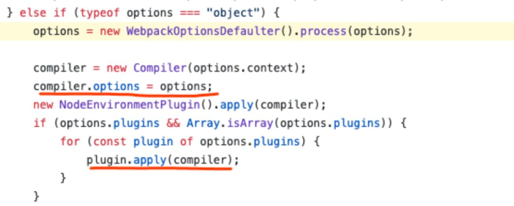
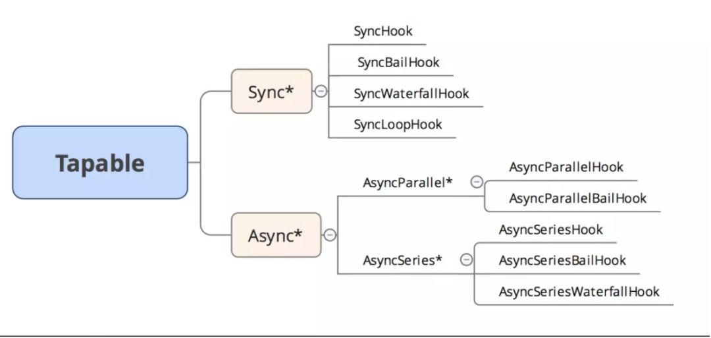
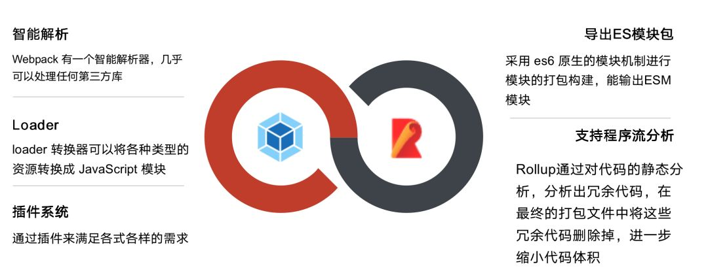

# 企业级 Webpack 分享总结(内附完整ppt)

## 基本打包机制

::: tip 解释
本质上，webpack 是一个现代 JavaScript 应用程序的**静态模块打包器**(`module bundler`)。当 webpack 处理应用程序时，它会**递归地构建**一个**依赖关系图**(`dependency graph`)，其中包含应用程序需要的每个模块，然后将所有这些模块**打包**成一个或多个`bundle`
:::

打包过程可以拆分为**四步**

1. 利用`babel`完成代码**转换**,并生成单个文件的**依赖**

2. 从入口**开始递归分析**，并**生成依赖图谱**

3. 将各个**引用模块打包**为一个**立即执行函数**

4. 将最终的`bundle`文件写入`bundle.js`中

完整代码见：https://github.com/LuckyWinty/blog/tree/master/code/bundleBuild

## 打包过程

以上是打包的基本机制，而webpack的**打包过程**，会基于这些基本步骤进行扩展，主要有以下步骤：

1. **初始化参数** 从配置文件和 Shell 语句中**读取与合并**参数，得出**最终的参数**

2. **开始编译** 用上一步得到的参数初始**Compiler对象**，**加载所有配置的插件**，通 过执行对象的run方法开始执行编译

3. **确定入口** 根据配置中的 Entry 找出所有入口文件

4. **编译模块** 从入口文件出发，调用所有配置的 `Loader` 对模块进行编译，再找出该模块依赖的模块，再递归本步骤直到所有入口依赖的文件都经过了本步骤的处理

5. **完成模块编译** 在经过第4步使用 Loader 翻译完所有模块后， 得到了每个模块被编译后的最终内容及它们之间的**依赖关系**

6. **输出资源**：根据入口和模块之间的依赖关系，组装成一个个包含多个模块的 `Chunk`,再将每个 `Chunk` 转换成一个单独的文件加入**输出列表**中，这是可以修改输出内容的最后机会

7. **输出完成**：在确定好输出内容后，根据**配置确定输出的路径和文件名**，将文件的内容写入文件系统中

整个流程概括为3个阶段，**初始化、编译、输出**。而在每个阶段中又会发生很多事件，Webpack会将这些事件广播出来供Plugin使用。具体钩子
可以看官方文档：https://webpack.js.org/api/compiler-hooks/#hooks

[Webpack4打包机制原理解析](https://mp.weixin.qq.com/s?__biz=MzI0MzIyMDM5Ng%3D%3D&chksm=f175e83bc602612d32a2568bfb74f4a9f762b058e9ba39d976c355ae916c27bca73c9fa3d65a&idx=1&mid=2649826040&scene=21&sn=d00485f9421520699740404f8ecf3302#wechat_redirect)

## Webpack Loader

Loader 就像一个翻译员，能将源文件经过转化后输出新的结果，并且一个文件还可以链式地经过多个翻译员翻译

### 概念

* 一个Loader 的职责是单一的，只需要完成一种转换

* 一个Loader 其实就是一个Node.js 模块，这个模块需要导出一个函数

### 开发Loader形式

* 基本形式

```
module.exports = function (source ) {
    return source;
}
```

* 调用第三方模块

```
const sass= require('node-sass');
module.exports = function (source) {
  return sass(source);
}
```

由于 `Loader` 运行在 Node.js 中，所以我们可以调用任意 Node.js 自带的 API ，或者安装第三方模块进行调用

* 调用Webpack的Api

```
//获取用户为 Loader 传入的 options
const loaderUtils =require ('loader-utils');
module.exports = (source) => {
    const options= loaderUtils.getOptions(this);
    return source;
}
//返回sourceMap
module.exports = (source)=> {
    this.callback(null, source, sourceMaps);
    //当我们使用 this.callback 返回内容时 ，该 Loader 必须返回 undefined,
    //以让 Webpack 知道该 Loader 返回的结果在 this.callback 中，而不是 return中
    return;
}
// 异步
module.exports = (source) => {
    const callback = this.async()
    someAsyncOperation(source, (err, result, sourceMaps, ast) => {
        // 通过 callback 返回异步执行后的结果
        callback(err, result, sourceMaps, ast)
    })
}
//缓存加速
module.exports = (source) => {
    //关闭该 Loader 的缓存功能
    this.cacheable(false)
    return source
}
```

source参数是compiler 传递给 Loader 的一个文件的原内容，这个函数需要返回处理后的内容，这里为了简单起见，直接将原内容返回了，相当于该Loader 有做任何转换.这里结合了webpack的api和第三方模块之后

[更多的webpack Api可以看官方文档](https://webpack.js.org/api/loaders)

## Webpack Plugin

专注处理 `webpack` 在编译过程中的**某个特定的任务**的功能模块，可以称为插件概念

* 是一个**独立**的模块

* 模块对**外暴露一个 js 函数**

* 函数的原型 (prototype) 上定义了一个注入 `compiler` 对象的 apply 方法 apply 函数中需要有通过 `compiler` 对象挂载的 `webpack` 事件钩子，钩子的回调中能拿到当前编译的 `compilation`对象，如果是异步编译插件的话可以拿到回调 callback

* 完成自定义子编译流程并处理 `complition` 对象的内部数据

* 如果异步编译插件的话，数据处理完成后执行 callback 回调

### 开发基本形式

Webpack 启动后，在读取配置的过程中会先执行 `new BasicPlugin(options)`初始化一个 `BasicPlugin` 并获得其实例。在初始化 `Compiler` 对象后，再调用 `basicPlugin.apply (compiler）`为插件实例传入 `compiler` 对象。插件实例在获取到 `compiler` 对象后，就可以通过 `compiler`. plugin （事件名称 ，回调函数）监听到 Webpack 广播的事件，并且可以通过 compiler 对象去操作 Webpack。

```
// 1、BasicPlugin.js 文件（独立模块）
    // 2、模块对外暴露的 js 函数
    class BasicPlugin{
        //在构造函数中获取用户为该插件传入的配置
        constructor(pluginOptions) {
            this.options = pluginOptions;
        }
        //3、原型定义一个 apply 函数，并注入了 compiler 对象
        apply(compiler) {
            //4、挂载 webpack 事件钩子（这里挂载的是 emit 事件）
            compiler.plugin('emit', function (compilation, callback) {
                // ... 内部进行自定义的编译操作
                // 5、操作 compilation 对象的内部数据
                console.log(compilation);
                // 6、执行 callback 回调
                callback();
            });
        }
    }
// 7、暴露 js 函数
module.exports = BasicPlugin;
```

### Compiler对象

compiler对象是 webpack 的**编译器**对象，compiler对象会在启动 webpack 的时候被一次性地初始化，**compiler对象**中包含了所有 webpack **可自定义操作的配置**，例如 loader 的配置，plugin 的配置，entry的配置等各种原始 webpack 配置



webpack部分源码：https://github.com/webpack/webpack/blob/10282ea20648b465caec6448849f24fc34e1ba3e/lib/webpack.js#L30

### Compilation 对象

compilation 实例继承于 compiler，compilation 对象代表了一次单一的版本 webpack 构建和生成编译资源的过程。当运行 webpack 开发环境中间件时，**每当检测到一个文件变化，一次新的编译将被创建，从而生成一组新的编译资源以及新的 compilation 对象**。一个 compilation 对象包含了 当前的模块资源、编译生成资源、变化的文件、以及 被跟踪依赖的状态信息。编译对象也提供了很多关键点回调供插件做自定义处理时选择使用。

Compiler 和 Compilation 的区别在于：**Compiler 代表了整个 Webpack 从启动到关闭的生命周期，而 Compilation 只代表一次新的编译**

### Tapable & Tapable 实例

webpack 的插件架构主要基于 Tapable 实现的，Tapable 是 webpack 项目组的一个内部库，主要是抽象了一套插件机制。它类似于 `NodeJS` 的 `EventEmitter` 类，专注于自定义事件的触发和操作。除此之外, Tapable 允许你通过回调函数的参数访问事件的生产者



webpack本质上是一种事件流的机制，它的工作流程就是将**各个插件串联起来**，而实现这一切的核心就是Tapable，webpack中最核心的**负责编译的Compiler和负责创建bundles的Compilation都是Tapable的实例**，Tapable 能够让我们为 javaScript 模块添加并应用插件。它可以被其它模块继承或混合。

### Tapable 模型

Tapable 简化后的模型，就是我们熟悉的发布订阅者模式

```js

class SyncHook{
   constructor(){
      this.hooks = {}
   }

   tap(name,fn){
    if(!this.hooks[name])this.hooks[name] = []
     this.hooks[name].push(fn)
   }

   call(name){
     this.hooks[name].forEach(hook=>hook(...arguments))
   }
}
```

[webpack 插件机制分析及开发调试](https://mp.weixin.qq.com/s?__biz=MzI0MzIyMDM5Ng%3D%3D&chksm=f175e8cdc60261db3c0caa44fd58e8d759526e5bb5b6e2caebba957a5996931cc68c18e69d37&idx=1&mid=2649825806&scene=21&sn=e46dbd274e240c4dcc4b778d8b30c67d#wechat_redirect)

## 构建工具选择

针对不同的场景，选择最合适的工具



通过对比，不难看出，**Webpack**和**Rollup**在不同场景下，都能发挥自身优势作用。webpack作为打包工具，但是在定义模块输出的时候，webpack确不支持ESM，webpack插件系统庞大，确实有支持模块级的`Tree-Shacking`的插件，如`webpack-deep-scope-analysis-plugin`。但是粒度更细化的，一个模块里面的某个方法，本来如果没有被引用的话也可以去掉的，就不行了....这个时候，就要上rollup了。rollup它**支持程序流分析**，能更加正确的判断项目本身的代码是否有副作用，其实就是rollup的`tree-shaking`更干净。所以我们的结论是**rollup 比较适合打包 js 的 sdk 或者封装的框架**等，例如，vue 源码就是 rollup 打包的。而 webpack 比较适合打包一些应用，例如**SPA 或者同构项目**等等。

结论:在开发应用时使用 **Webpack**，开发库时使用 **Rollup**

::: tip 参考链接
来源：winty https://blog.csdn.net/LuckyWinty/article/details/103590665

[Webpack4打包机制原理解析](https://mp.weixin.qq.com/s?__biz=MzI0MzIyMDM5Ng%3D%3D&chksm=f175e83bc602612d32a2568bfb74f4a9f762b058e9ba39d976c355ae916c27bca73c9fa3d65a&idx=1&mid=2649826040&scene=21&sn=d00485f9421520699740404f8ecf3302#wechat_redirect)

[webpack 插件机制分析及开发调试](https://mp.weixin.qq.com/s?__biz=MzI0MzIyMDM5Ng%3D%3D&chksm=f175e8cdc60261db3c0caa44fd58e8d759526e5bb5b6e2caebba957a5996931cc68c18e69d37&idx=1&mid=2649825806&scene=21&sn=e46dbd274e240c4dcc4b778d8b30c67d#wechat_redirect)

[webpack中的HMR(热更新)原理剖析](https://mp.weixin.qq.com/s?__biz=MzI0MzIyMDM5Ng%3D%3D&chksm=f175eb16c6026200933472fd8f4b8d46b725f072608c2fe4fe11c1ccd78a563d21e0e9ab9a47&idx=1&mid=2649825749&scene=21&sn=c9528c31aa54836e2e3754ff93913e1b#wechat_redirect)

[Webpack性能优化总结大全](https://mp.weixin.qq.com/s?__biz=MzI0MzIyMDM5Ng%3D%3D&chksm=f175eb1cc602620a66821baedcb2663e393f7ae4857e8daf6d57e4c436f9a7297a555d0e4750&idx=1&mid=2649825759&scene=21&sn=726279d3dfc2ea0b6ba34788517753ad#wechat_redirect)
:::