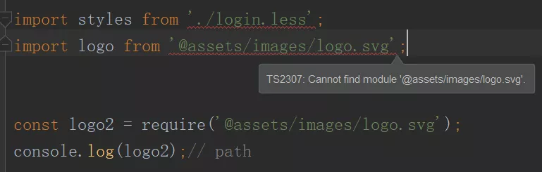
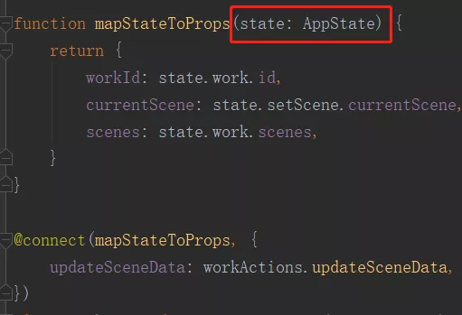
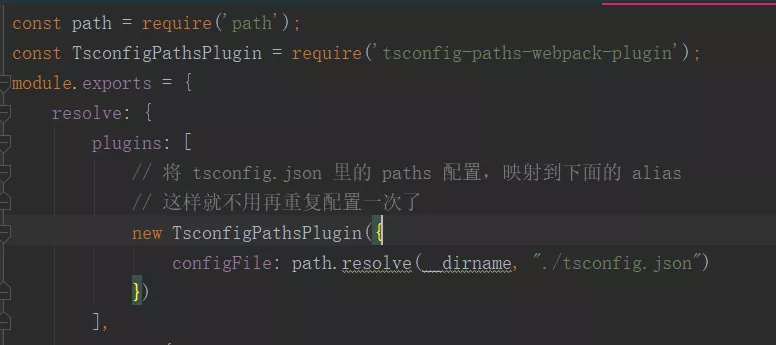
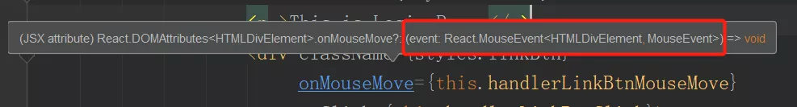

# 耗时一年整理，全网最全的TypeScript踩坑集锦（React + TS 项目问题）

## 1. 使用 import 引入非 JS 模块会报错，而使用 require 则没有问题

```
import styles from './login.less';
import logo from '@assets/images/logo.svg';

const logo2 = require('@assets/images/logo.svg');
console.log(logo2);// path
```


**解决办法：** 给这些非 JS 模块添加申明
```
/**
 * style
 */
declare module '*.css'
declare module '*.less'
// declare module "*.less" {
//     const styles: { [className: string]: string };
//     export default styles
// }
declare module '*.scss'


/**
 * 图片
 */
declare module '*.svg'
declare module '*.png'
declare module '*.jpg'
declare module '*.jpeg'
declare module '*.gif'
declare module '*.bmp'
```

## 2. import * as React from 'react' 和 import React from 'react' 有什么区别

* 第一种写法是将**所有用 export 导出**的成员赋值给 React ，导入后用 React.xxx 访问
* 第二种写法仅是将默认导出（**export default**）的内容赋值给 React

## 3. react + redux + react-redux 项目：使用 @connect 装饰器正常，但是一旦结合 TS 后，就会报错

https://segmentfault.com/a/1190000016047027

```
import {ComponentClass} from 'react'
import {
    connect as nativeConnect,
    MapDispatchToPropsParam,
    MapStateToPropsParam
} from 'react-redux'
import {withRouter as nativeWithRouter} from 'react-router-dom'

export type ComponentDecorator<P = any> = <T extends ComponentClass<P>>(WrappedComponent: T) => T

export const connect: <P, S>(
    mapState: MapStateToPropsParam<Partial<P>, P, S>,
 // mapDispatch?: MapDispatchToPropsParam<Partial<P>, P>
    mapDispatch?: any
) => ComponentDecorator = nativeConnect as any;

export const withRouter: ComponentDecorator = nativeWithRouter as any;
```

## 4. react + redux + react-redux 项目：在使用 mapStateToProps(state) 函数时，想要给仓库中的 state 声明类型
* 借助 ReturnType
```
// rootReducer.ts
import {combineReducers} from 'redux';
import {connectRouter} from 'connected-react-router';
import history from '../history';
import evidenceEdit from './evidence';
import common from './common';
import work from './work';
import setScene from './set-scene';

let reducers = {
    common,
    work,
    setScene,
    evidenceEdit,
    router: connectRouter(history)
};

// 使用 ReturnType 从 rootReducer 推断状态形状
// export type AppState = ReturnType<typeof rootReducer>
export type AppState = {
    [key in keyof typeof reducers]: ReturnType<typeof reducers[key]>
}

const rootReducer = combineReducers(reducers);

export default rootReducer;
// setScene 模块
import * as types from '../types/action-types';
import {appEditAction} from '../actions/common';

export interface SetSceneState {
    loadSuccess: boolean;
    loadProgress: number;
}

let initState: SetSceneState = {
    loadSuccess: false,
    loadProgress: 0,
};
export default function (state: SetSceneState = initState, action: appEditAction) {
    switch (action.type) {

        case types.SCENE_DATA_LOADSUCCESS: {
            return {...state, loadSuccess: action.payload.success};
        }
        case types.SCENE_DATA_LOADINGPROGRESS: {
            return {...state, loadProgress: action.payload.num};
        }
        default:
            return state;
    }
}
```

使用


## 5. react + redux + react-redux 项目：想要给 action creator 函数声明类型

```
// 在 Mesh 组件中
import workActions from "@store/actions/work";

interface MeshProps {
    // 刚开始我是这样写的，每次都得在组件的 Props 里重新声明一下函数
    // updateSceneData?: (workId: string,data) => appEditAction;
    updateData?: typeof workActions.updateData;
}

@connect(null, {
    updateData: workActions.updateData,
})
class Mesh extends React.Component<MeshProps> {...}
// store/actions/work.ts

import * as types from '../types/action-types';
import {appEditAction} from "@edit-store/actions/common";

export default {
    updateWorkData(workId: string, data: any): appEditAction {
        return {type: types.UPDATE_WORK_ASYNC, payload: {workId, data}}
    }
}
```

## 6.  react + redux + react-redux 项目：给 React 组件的 Props 声明类型（较为便捷的方法）
```
import * as React from 'react';
import {RouteComponentProps} from 'react-router';
import {connect} from "@store/connect";
import {AppState} from "@store/reducers";
import commonActions from "@store/actions/commonActions";

// 组件可能有四个属性来源
// 1.mapStateToProps 的返回值
// 2.actions 对象类型
// 3.来自路由
// 4.父组件传进来的其它属性

// 原先的写法：一个个拼起来，mapStateToProps 返回的状态还得在 Props 接口里再声明一遍，比较混乱、麻烦
// interface Props {
//     loadProgress?: number;
//     markVisible?: boolean;
//     setMarkVisible?: typeof commonActions.setMarkVisible;
// }

function mapStateToProps(state: AppState) {
    const {markVisible,loadProgress} = state;
    return {
        markVisible,
        loadProgress,
    };
}

// 现在的写法：便捷
type StateProps = ReturnType<typeof mapStateToProps>;
type DispatchProps = typeof commonActions;
interface IParams {}
type RouteProps = RouteComponentProps<IParams>;
type Props = StateProps & RouteProps & DispatchProps & {};

@connect(mapStateToProps, {
    setMarkVisible: commonActions.setMarkVisible
})
export default class App extends React.PureComponent<Props, any> {
    render() {
        const {markVisible, loadProgress} = this.props;
        return (<div > {markVisible} {loadProgress} </div>);
    }
}

```

## 6. react + redux + react-redux 项目：想要给 redux-thunk 声明类型
redux thunk 有一个内置类型 `ThunkAction`，我们可以这样使用：
```
// src/thunks.ts

import { Action } from 'redux'
import { sendMessage } from './store/chat/actions'
import { AppState } from './store'
import { ThunkAction } from 'redux-thunk'

export const thunkSendMessage = (
  message: string
): ThunkAction<void, AppState, null, Action<string>> => async dispatch => {
  const asyncResp = await exampleAPI()
  dispatch(
    sendMessage({
      message,
      user: asyncResp,
      timestamp: new Date().getTime()
    })
  )
}

function exampleAPI() {
  return Promise.resolve('Async')
}
```

## 7. 使用 webpack 的 module.hot 会警告没有类型定义
```
# 下载这个类型声明文件
$ npm install --save @types/webpack-env
if (process.env.NODE_ENV !== 'production') {
    if (module.hot) {
        module.hot.accept('./reducers', () => store.replaceReducer(rootReducer));
    }
}
```

## 8. tsconfig-paths-webpack-plugin 这个包会将 tsconfig.json 中的 path 配置项内容映射到 webpack 配置中去，这样就不需要在 webpack 中的 alias 配置项里配置路径映射



## 9. react 函数组件声明

```
interface Greeting {
    name: string;
    age: number;
}

const Hello:React.FC<Greeting> = (props) => <h1>Hello {props.name}</h1>;

// 推荐使用第二种
const Hello2 = (props:Greeting) => <h1>Hello {props.name}</h1>;
```

## 10. 如何编写 react + ts 版的 HOC

```
import React, { Component } from 'react';

import HelloClass from './HelloClass';

interface Loading {
    loading: boolean
}

// HOC 可以接收一个类组件，也可以接收一个函数组件，所以参数的类型是 React.ComponentType
// 源码：type ComponentType<P = {}> = ComponentClass<P> | FunctionComponent<P>;
function HelloHOC<P>(WrappedComponent: React.ComponentType<P>) {
    return class extends Component<P & Loading> {
        render() {
            const { loading, ...props } = this.props;
            return loading ? <div>Loading...</div> : <WrappedComponent { ...props as P } />;
        }
    }
}

export default HelloHOC(HelloClass);
```

## 11. 快速获取事件处理函数的 event 参数类型

```
 class Login extends React.Component <Props>{

    handlerLinkBtnClick = (ev) => {
          console.log(ev);
        this.props.historyGo('./register');
    };

    handlerLinkBtnMouseMove = (ev) => {
       console.log(ev);
    };

    render() {
        return (
            <div>
                <header>
                    <p >This is Login Page </p>
                    <div className={styles.linkBtn}
                         onMouseMove={this.handlerLinkBtnMouseMove} 
                         onClick={this.handlerLinkBtnClick}>
                         Go to Register Page
                   </div>
                </header>
            </div>
        );
    }
}
```

按住 Ctrl ，然后鼠标移动到事件名上就能获取当前事件处理函数的参数类型


:::tip 涉及链接
[typescript中文版](https://www.tslang.cn/)
:::