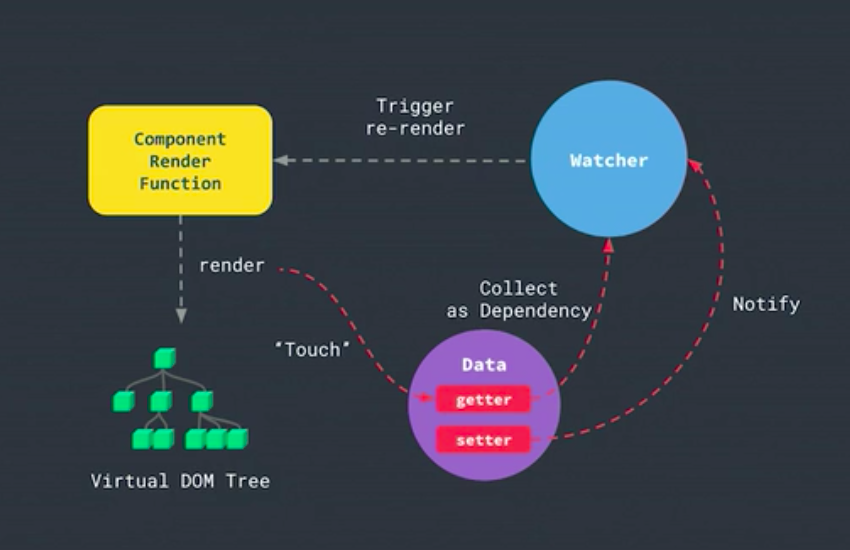
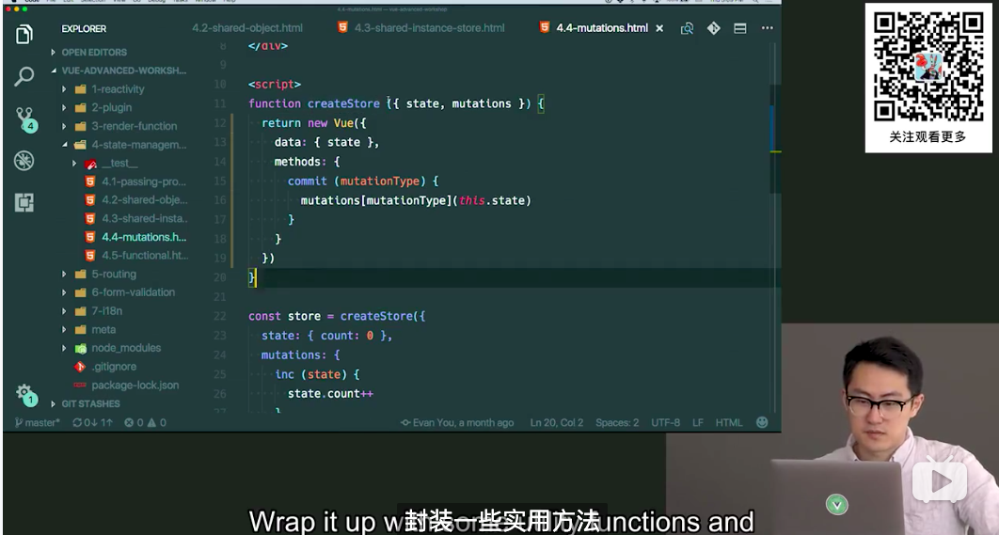
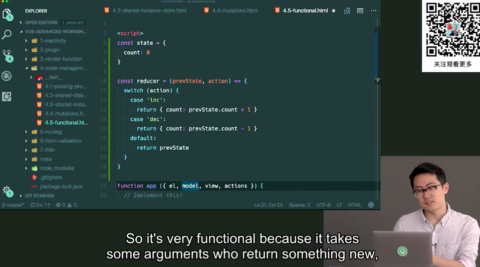

# 观看尤大大视频总结

[bilbil链接](https://www.bilibili.com/video/BV1d4411v7UX?p=42)

[练习地址](https://github.com/d-levin/vue-advanced-workshop)

## 虚拟dom

虚拟dom只是个**对象**，但通过**原生dom方法**创建性能方面消耗的更多，原生dom方法上面有很多属性

由于浏览器javascript和GUI是互斥的，一边操作dom，一边渲染dom也会影响性能

1. 虚拟dom比原生dom方法更加节省资源

2. 可以将渲染逻辑在dom节点抽离出来，应用到不同的环境中，比如用在原生应用中，`react-native, weex`, 小程序等

## plugin Vue.use

vue使用的混入的方式，install函数传入vue，可以通过vue.mixin来实现所有的组件，做任何事情

```javascript
const RulesPlugin = {
  install (Vue) {
    Vue.mixin({
      created () {
        if (this.$options.hasOwnProperty('rules')) {
          // Do something with rules
          const rules = this.$options.rules
          Object.keys(rules).forEach(key => {
            const rule = rules[key]
            this.$watch(key, newValue => {
              const result = rule.validate(newValue)
              if (!result) {
                console.log(rule.message)
              }
            })
          })
        }
      }
    })
  }
}

Vue.use(RulesPlugin)
```

## 渲染流程



每个组件都有渲染函数，渲染函数通过观察者watcher收集依赖，并且发布订阅

因为有个数据跟踪系统，当更改数据的时候，可以精确到对应的渲染组件，不会造成过多的组件重复渲染

但React使用的是基于自上而下的渲染机制，不做优化，会导致重复渲染，需要在`shouldComponentUpdate`来优化，或者用`pureComponent`

但vue监听这些数据的消耗了部分开销，无法避免的

```javascript
function isObject (obj) {
    return typeof obj === 'object'
      && !Array.isArray(obj)
      && obj !== null
      && obj !== undefined
}

function observe (obj) {
  if (!isObject(obj)) {
    throw new TypeError()
  }

  Object.keys(obj).forEach(key => {
    let internalValue = obj[key]
    let dep = new Dep()
    Object.defineProperty(obj, key, {
      get () {
        dep.depend()
        return internalValue
      },
      set (newValue) {
        const isChanged = internalValue !== newValue
        if (isChanged) {
          internalValue = newValue
          dep.notify()
        }
      }
    })
  })
}

window.Dep = class Dep {
  constructor () {
    this.subscribers = new Set()
  }

  depend () {
    if (activeUpdate) {
      // register the current active update as a subscriber
      this.subscribers.add(activeUpdate)
    }
  }

  notify () {
    // run all subscriber functions
    this.subscribers.forEach(subscriber => subscriber())
  }
}

let activeUpdate

function autorun (update) {
  function wrappedUpdate () {
    activeUpdate = wrappedUpdate
    update()
    activeUpdate = null
  }
  wrappedUpdate()
}
```

## 模版和渲染函数jsx

模版和jsx都是声明dom节点和状态state之间的关系

模版是更加**静态**，更加被约束的一种表达式，更加容易优化编译，可以在编译模版转化成jsx时做更多的优化，

jsx更加**动态**，更加自由, 灵活的使用编程语言，由于因为是动态的原因，所以优化的相对比较少

渲染函数的区别

由此看出，vue第二个参数可以传的值更加多一些

```javascript
<!-- vue -->
render(h) => h('div', {prop, attr, class, style}, [children])
<!-- react -->
create('div', {prop}, [children])
```

## 组件

正常组件（有状态组件）， 函数组件(无状态组件)差别在于正常组件可以实例化，函数组件无法实例，通过`functional: true`render 通过第二个参数传入this

函数组件
**更加容易扩展**
**复用性比较高**
**简单无状态**

## 高阶组件

传入组件，生成新的组件，也就是组件的增强版

比如一个ui组件显示头像，传入prop，src链接，显示图片，在外面一层包装逻辑组件，通过api获取链接，装饰器

与mixin区别在于，ui组件不会被污染，并且ui组件可能用到别的地方，

1. 有更高的复用性

2. 方便测试，可以测试ui组件和逻辑组件

根据不同的场合，选择高阶组件还是mixin, 高阶组件，会使得更加复杂，嵌套更多的组件，但mixin可以避免这个问题

```js
<div id="app">
  <smart-avatar username="vuejs"></smart-avatar>
</div>

<script>
// mock API
function fetchURL (username, cb) {
  setTimeout(() => {
    // hard coded, bonus: exercise: make it fetch from gravatar!
    cb('https://avatars3.githubusercontent.com/u/6128107?v=4&s=200')
  }, 500)
}

const Avatar = {
  props: ['src'],
  template: ``
}

function withAvatarURL (InnerComponent) {
  return {
    props: {
      username: String
    },
    data () {
      return {
        url: 'http://via.placeholder.com/200x200'
      }
    },
    created () {
      fetchURL(this.username, (url) => { this.url = url })
    },
    render (h) {
      return h(InnerComponent, { props: { src: this.url } })
    }
  }
}

const SmartAvatar = withAvatarURL(Avatar)

new Vue({
  el: '#app',
  components: { SmartAvatar }
})
```

## 状态管理 vuex

三大框架react, vue, angular优势在于数据与渲染分离

vue已经完美的分离数据，并且使用在vue， 但同时带来的弊端在于随处都能修改状态，无论在任何地方，**当应用十分庞大复杂的时候，跟踪存储状态的位置以及修改状态的位置变得更加复杂，并且应用变得不可预测的**

根据不同的场合判断是否使用vuex

数据被多个组件共享

data是个函数是因为需要每个组件都是有独立的数据，而不是共享同一个数据

需要将数据加入到data中，才有响应性

vuex原理应该是创建个组件，放入根组件，将data传入个对象，而不是函数，那么所有使用到该组件都会被共享

mutations 和 actions, mutations必须是同步的，这是因为mutations是改变数据状态，可以方便比较函数调用前后的数据差异，**目的是将异步代码和改变状态代码分离开**

vuex的实现方式主要是基于vue实例的响应式



## redux

react 数据是不可变



## vue-router

获取当前的hash: window.location.hash
监听hash变化:
window.addEventListener('hashChange', () => {})

vue如何路由正则表达式，运用了一个库path-to-regexp

```js
// '#/foo/123' -> foo with id: 123
// '#/bar' -> Bar
// '#/404' -> NotFound

// path-to-regexp usage:
// const regex = pathToRegexp(pattern)
// const match = regex.exec(path)

const Foo = {
  props: ['id'],
  template: `<div>foo with id: {{ id }}</div>`
}
const Bar = { template: `<div>bar</div>` }
const NotFound = { template: `<div>not found!</div>` }

const routeTable = {
  '/foo/:id': Foo,
  '/bar': Bar
}

const compiledRoutes = []
Object.keys(routeTable).forEach(key => {
  const dynamicSegments = []
  const regex = pathToRegexp(key, dynamicSegments)
  const component = routeTable[key]
  compiledRoutes.push({
    component,
    regex,
    dynamicSegments
  })
})

window.addEventListener('hashchange', () => {
  app.url = window.location.hash.slice(1)
})

const app = new Vue({
  el: '#app',
  data: {
    url: window.location.hash.slice(1)
  },
  render (h) {
    const path = '/' + this.url

    let componentToRender
    let props = {}

    compiledRoutes.some(route => {
      const match = route.regex.exec(path)
      componentToRender = NotFound
      if (match) {
        componentToRender = route.component
        route.dynamicSegments.forEach((segment, index) => {
          props[segment.name] = match[index + 1]
        })
        return true
      }
    })

    return h('div', [
      h(componentToRender, { props }),
      h('a', { attrs: { href: '#foo/123' }}, 'foo 123'),
      ' | ',
      h('a', { attrs: { href: '#foo/234' }}, 'foo 234'),
      ' | ',
      h('a', { attrs: { href: '#bar' }}, 'bar'),
      ' | ',
      h('a', { attrs: { href: '#garbage' }}, 'garbage')
    ])
  }
})
```

## 表单验证

vee-validate, vuelidate

可以通过compose组合函数，直接验证对应的值

```js
const validationPlugin = {
  install (Vue) {
    Vue.mixin({
      beforeCreate () {
        if (this.$options.validations) {
          this.$options.computed = Object.assign({}, this.$options.computed, {
            $v () {
              let errors = []
              let valid = true
              const rules = this.$options.validations

              Object.keys(rules).forEach(key => {
                const rule = rules[key]
                const value = this[key]
                const result = rule.validate(value)
                if (!result) {
                  valid = false
                  errors.push(rule.message(key, value))
                }
              })

              return {
                errors,
                valid
              }
            }
          })
        }
      }
    })
  }
}
```
