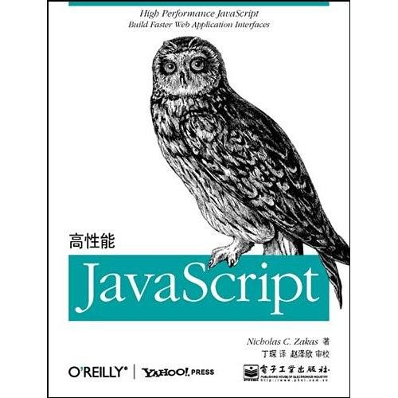

# 高性能javascript

## 浏览器在代码执行的过程中遇到script标签都会阻塞浏览器执行

* 位置：script代码*合放置于`body`结束标签前，确保页面渲染之后再执行脚本，不会导致长时间空白屏
* 合并：合并脚本，减少script标签，不管是外链还是内嵌脚本
* 下载方式：优化script代码无非就是保证script最后执行，无阻塞执行
  * script标签使用**defer**属性
  * **动态创建**script标签

```js
  function loadScript(url, script) {
    var script=document.createElement('script')
    script.type="text/javascript";
    if(script.readyState){ // IE
      script.onreadystatechange = function () {
      if (script.readyState === "loaded" || script.readyState === "complete") {
        script.onreadstatechange = null;
        callback();
      } else { // 其他浏览器
          script.onload = function () {
            callback();
          }
      }
      script.src = url
      document.getElementsByTagName("body")[0].appendClid(script)
      }
    }
  }
  ```

* **xhr对象**执行下载`javascript`注入到页面中

### 常用的延时加载库

* YUI3
* LazyLoad
* LABjs

## 对象的优化

* 访问**字面量**和**变量**比访问**对象**和**对象成员**要快
* 经常定义**局部变量**，作用域链位置越深，访问所需的时间更长
* **属性**和**方法原型**的**位置越深**，访问的时间越长
* 一般来说，常访问的变量将一个**局部变量**来保存，可以**提高访问速度**

## Dom节点优化

* **减少**`dom`节点的访问次数
  * `innerHTML`（常用）
  * `cloneNode`(克隆方法）

* 多次访问某个`dom`节点，使用**局部变量**来**存储**
* html集合会实时连接着底层文档，将集合长度**缓存**在一个**变量**中，如果经常使用该集合，可以转成**数组**来使用，使用数组比使用集合要快N倍
* 披露修改`dom`节点时，需将元素**脱离文档流**，处理`dom`元素之后，再带回文档中

### 脱离文档流方法

* 隐藏元素，引用修改，重新显示，使用display

```js
  var ul = document.getElementById('list');
  ul.style.display="none"
  appendDataToElement(ul, data) // 更新节点通用函数
  ul.style.display="block"
```

*使用文档片段document.createDocumentFragment来操作（最优）

```js
  var fragment = document.createDocumentFragment()
  appendDataToElement(fragment, data) // 更新节点通用函数
  document.getElement('list').appendChild(fragment)
```

* 先克隆元素，在处理

```js
  var old=document.getElementById('list')
  var clone = old.cloneNode(true)
  appendDataToElement(fragment, data) // 更新节点通用函数
  old.parentNode.replace(clone, old)
```

* 常用的方法

| 属性名 | 被代替的属性名 |
| ------------- |:-------------:|
| children | childNodes |
| childElementCount | childNodes.length |
| firstElementChild | firstChild |
| lastElementChild | lastChild | 
| nextElementSibling | nextSibling |
| previousElementSibling | previousSibling |

* 动画使用绝对定位，使用拖放代理
* 使用事件委托减少事件处理器的数量

## JS的算法和流程控制

* 使用`for`, `while`, 和`do-while`循环性能特性相当，但避免使用`for-in`循环，除非需要遍历一个属性未知的对象， 函数的迭代`forEach`, `map`性能比原始的for循环

* 使用查找表比`if-else`和`switch`更快

```js
// 返回值集合存入数组
var results = [result0, result1, result2]
// 返回当前的结果
return results[value]
```

* **递归**：函数通过自身反复的调用，或者**两个函数**之间**反复**的调用达到循环的目的。递归会有栈溢出的风险

  **迭代（遍历）**：递归的实现算法都可以用迭代来实现，通过**循环**来实现
::: tip 提示
如果由于使用**递归**算法导致**栈溢出**，可以考虑使用迭代算法或者memoization来避免重复计算
:::

## 字符串和正则表达式

* 如果考虑**ie7**以及更早的版本的话，可以使用**数组合并**，再转成字符串。不考虑的话使用**简单的+和+=操作符**来替代
* 回溯既是正则表达式匹配功能的基本组成部分，也是正则表达式的低效之源，回溯失控发生于正则表达式原本能快速匹配的地方，由于某些特殊字符导致运行缓慢甚至浏览器奔溃

### 避免该问题的发生

* 使用**相邻**的**字元互斥**
* 避免量词对同一字符串的**相同部分多次匹配**
* 通过服用利用**预查的原子组**去除不必要的回溯

## js代码编程实战

* **避免双重求值**， 因为通过动态执行字符串时，会自动创建一个新的解析器实例，来执行这字符串
动态执行字符串中的js方法：
  * eval()

    ```js
    eval('num1+num2')
    ```

  * function()构造器

    ```js
    new Function('num1','num2', 'return num1+num2' )
    ```

  * setTimeout
  
    ```js
    setTimeout('num1+num2', 25)
    ```

  * setTimeInterval

    ```js
    setTimeInterval('num1+num2', 25)
    ```

* **避免重复工作** 需要检测浏览器时，可以使用延迟加载或条件预加载

```js
function addHandler(target, eventType, handler) {
    if (target.addEventListener) {
        target.addEventListener(eventType, handle, false)
    } else { // IE
      target.attactEvent('on' + eventType, handler)
    }
}
```

### 解决办法

* 延迟加载: 第一次调用时，先检查一下并决定使用那个方法，然后原始函数会被正确的函数覆盖

  ```js
      function addHandler(target, eventType, handler) {
      if (target.addEventListener) {
          addHandler = target.addEventListener(eventType, handle, false)
      } else { // IE
        addHandler = target.attactEvent('on' + eventType, handler)
      }
      // 调用新函数，并且覆盖
      addHandler(target, eventType, handler)
  }
  ```

  * 条件预加载: 在脚本加载时直接提前检测，不会等到调用时再检测

  ```js
  var addHandle = document.body.addEventListener ? function addHandler(target, eventType, handler) {
  target.addEventListener(eventType, handle, false)
  } : function addHandler(target, eventType, handler) {
        // IEtarget.attactEvent('on' + eventType, handler)
      }
  ```

* 尽量使用直接量创建对象或数组，直接量比非直接量的形式要快
* 数学计算时，考虑使用操作数字的二进制形式的[**位运算**](https://juejin.im/post/5dc36f39e51d4529ed292910)
* 尽量用js中的原生方法，比如Math方法

#### 书籍

