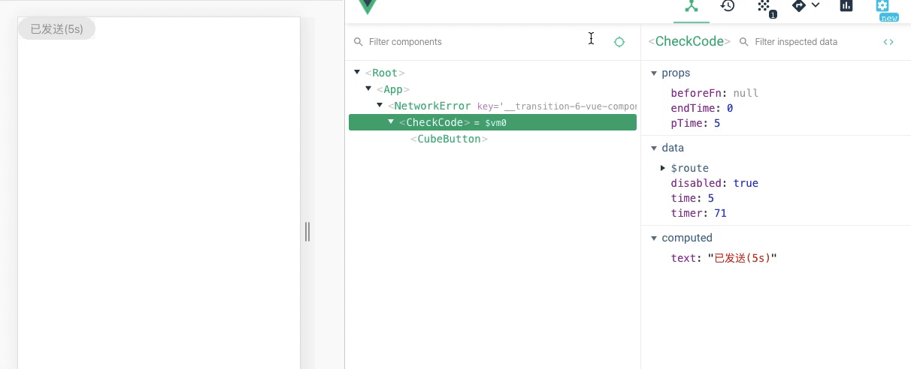

# 验证码封装组件

## 效果设计

1. 点击验证码，有**倒计时**的效果

2. 点击验证码之前事件触发，并且可以**阻止发送验证码**

3. 发送验证码，**发送完成之后，事件回调**

4. 发送验证码每一步，**有相应的事件回调**

## props 设计

1. beforeFn 调用前回调事件，由于vue的this.$emit通知父组件，但是父组件调用的时候，子组件无法拿到父组件调用函数的返回值，所以使用props传递

2. endTime 定时器结束到的次数停止

3. txt 默认文案提示

```
// 点击前调用
beforeFn: {
    type: [Function, null],
    default: null
},
pTime: {
  type: Number,
  defalut: 60
},
// 结束次数时间
endTime: {
    type: Number,
    default: 0
},
txt: {
    type: String,
    default: '获取验证码'
}
```

### data设计

```
// prop传递的倒计时次数
data () {
    return {
      timer: null,
      time: this.pTime, // 倒数次数
      disabled: false
    }
  }
```

### 点击触发事件 clickHandle

```
async clickHandle () {
  // 如果定时器已经触发，直接返回
  if (this.timer) return

  // 禁用点击按钮
  this.disabled = true

  // 点击前回调
  if (this.beforeFn) {
    // 点击前调用
    const result = await this.beforeFn()
    // 如果返回false，直接中止
    if (!result) {
      this.disabled = false
      return
    }
  }

  // 调用倒计时方法
  this.setTimer()
}
```

### 调用倒计时方法 setTimer

```
setTimer () {
  this.timer = setTimeout(() => {
    if (this.time > this.endTime) {
      this.time -= 1

      // 倒计时每一步，事件回调
      this.$emit('on-each', this.time)
      this.setTimer()
    } else if (this.time === this.endTime) {

      // 倒计时完成，事件回调
      this.$emit('on-finish')

      // 清空定时器
      clearTimeout(this.timer)
      this.disabled = false
      this.timer = null
      this.time = this.pTime
    }
  }, 1000)
}
```

### 组件销毁时清除定时器

```
  beforeDestroy () {
    this.timer && clearTimeout(this.timer)
  }
```

## 最后倒计时效果


