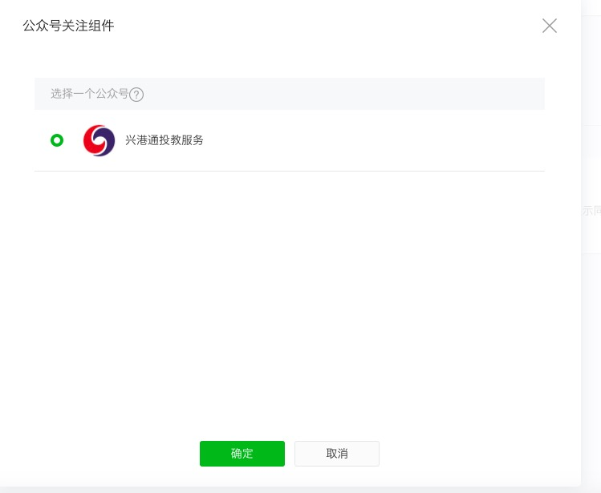
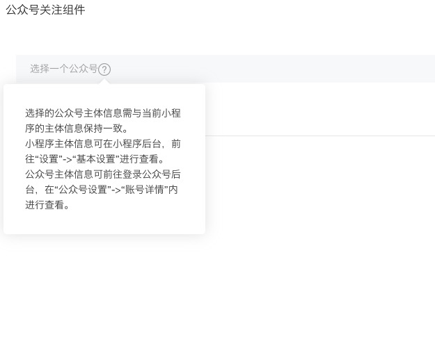
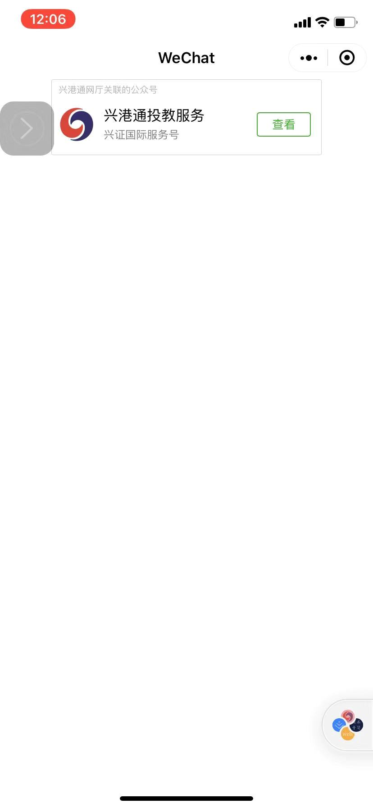
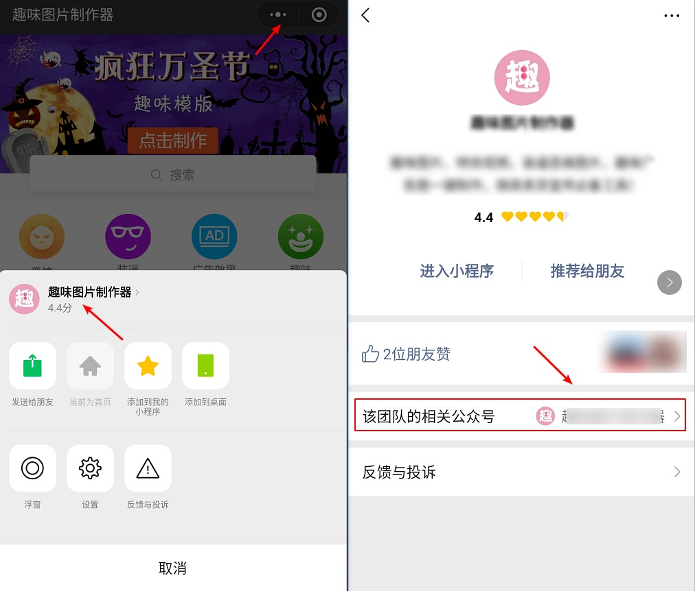

# 微信小程序内嵌webview 遇到的问题总结

::: tip 前言
由于我的项目都是由web页面搭建的，突然有一天项目经理说需要搭建一个与该项目一摸一样的微信小程序
如果重新开发的话，那花费的成本会很大，我浏览了一下微信小程序文档发现，可以通过webview来内嵌小程序来实现
这样避免了需要重复开发相同代码
:::

## 业务域名

#### 涉及到的第三方链接

* 阿里云图片地址（该项目用到的是阿里云的oss）(图片显示)

https://xyzq-static.oss-cn-shenzhen.aliyuncs.com

* 七鱼地址（引用在本地）(在线客服)

/static/js/qiyunkf.js

* 高德地图地址(仅用于通用业务获取定位)

//webapi.amap.com/maps?v=1.4.15&key=cbfc0b347323de3f78edf4145a93df26

* 微信公众号文章地址(查看微信公众号文章（入金-办理香港银行卡指南))

https://mp.weixin.qq.com/mp/homepage?__biz=Mzg3MDIzNjE4Mg==&hid=2&sn=ff409e4abd09e7a510b2fe995ddea933

* 获取客户端的ip(获取客户端的ip)

//pv.sohu.com/cityjson?ie=utf-8

* 无痕验证地址(无痕验证)

g.alicdn.com/sd/nvc/1.1.112/guide.js?2019062501

### 小程序内嵌webview分为两种

* 第三方纯js文件

1. **高德地图地址**(仅用于通用业务获取定位)
2. **获取客户端的ip**(获取客户端的ip)
3. **无痕验证地址**(无痕验证)

* 需要链接的地址（这就是所谓的业务域名）

1. **阿里云图片地址**
2. **七鱼客服地址**

### 解决方案

* 第三方纯js文件无需解决
* 阿里云图片地址也是**上传文件**，在根路径上传**校验文件**
* 七鱼客服地址，在其后台上传**校验文件**

### 微信文章

小程序需要关联公众号
但目前来说微信模版不能访问，但微信文章详情可以访问
可以访问微信详情的**图片，视频**，最好使用4g网络来访问

公众号可**关联10个同主体**，**3个非同主体**小程序

一个小程序**可关联500个公众号**

解决方案

* 在**业务项目**做一个类似微信模版的页面，然后通过webview跳转
* 可以在**微信文章详情**编辑成一个类似微信模版的页面。

#### 相关链接

[页面模版(不可访问)](https://mp.weixin.qq.com/mp/homepage?__biz=Mzg3MDIzNjE4Mg==&hid=2&sn=ff409e4abd09e7a510b2fe995ddea933?session=DIAjvdk2WuwTEQUcFC3Tw2AKK&platformType=miniProgram#wechat_redirect)

[微信文章详情(关联后可访问)](https://mp.weixin.qq.com/s?__biz=Mzg3MDIzNjE4Mg==&mid=100000516&idx=2&sn=1e1ebb56d838d5a86197bc53c03949ea&scene=19#wechat_redirect)

[微信小程序 web-view打开公众号 页面模板文章](https://developers.weixin.qq.com/community/develop/doc/000ea261644c705e0ff6316865c000)

::: tip 总结
之前在这里踩了很多坑，引用在线客服会报(没有配置业务域名) 错误
实际上经过我一个个js文件测试发现。业务域名值的是地址链接，而不包括js文件
七鱼客服 js会动态生成iframe,src这个地址，导致七鱼需要配置校验文件
阿里云是需要打开图片
微信文章的话只能打开微信详情
:::

### 涉及到的网址

[微信webview组件](https://developers.weixin.qq.com/miniprogram/dev/component/web-view.html)

## 由于内嵌webview，没有返回按钮，怎么办

### 提出问题

内嵌webview，登录之后进入首页，首页点击其他页面，需要打开原生小程序页面，才会显示返回箭头

### 解决方案

* 打开webview地址，可以传入一个标识，让应用来识别是从小程序打开
* 引入[微信sdk](//res2.wx.qq.com/open/js/jweixin-1.4.0.js)
* 当点击需要跳转的时候，调用微信小程序方法  window.wx.miniProgram.navigateTo

#### 相关代码

```
export function checkIsMiniProgram () {
  return window.sessionStorage.getItem('platformType') && window.sessionStorage.getItem('platformType') === 'miniProgram'
}
function wxNavigateTo (object) {
  if (window.wx && window.wx.miniProgram) {
    window.wx.miniProgram.navigateTo(object)
  }
}
// 微信小程序跳转
/**
 * 两种情况
 * 1.直接传入字符串，默认是地址
 * 2.如果是对象, params里面可包含路由对象，第二个参数是微信小程序跳转的参数
 */
export function navigateTo (params, wxParams = {}) {
  const session = storage.session.getItem('session')
  if (typeof params === 'string') {
    // 只是传入地址
    if (checkIsMiniProgram()) {
      const url = window.encodeURIComponent(`${params}?session=${session}`)
      wxNavigateTo({
        url: `../webview/webview?url=${url}`
      })
    } else {
      location.href = params
    }
  } else if (typeof params === 'object') {
    const { path, ...routeParams } = params
    if (checkIsMiniProgram()) {
      const url = window.encodeURIComponent(`${window.location.origin + path}?session=${session}`)
      wxNavigateTo({
        url: `../webview/webview?url=${url}`,
        ...wxParams
      })
    } else {
      this.$router.push({
        path,
        ...routeParams
      })
    }
  }
}

```

* 小程序代码，创建webview页面，来接收地址

```
webview.js
Page({
  data: {
    url: ''
  },
  onLoad: function (options) {
    let url = decodeURIComponent(options.url)
    console.log(url)
    if (/\?/.test(url)) {
      url += '&platformType=miniProgram#wechat_redirect'
    } else {
      url += '?platformType=miniProgram#wechat_redirect'
    }
    console.log(url)
    this.setData({
      url: url
    })
  }
})

```

## 小程序跳转到公众号

由于官方不直接支持跳转到公众号

由于我们需要指引关注的公众号有两个，一个是投教服务，一个是兴业证券，而且又是嵌套webview的界面，所以通过原生组件的方式来实现
需要跳转两次，webview跳转到原生组件，然后通过原生组件跳转到公众号

### 解决方案

1. 通过组件来实现

* official-account
配置关注的公众号，而且只能选择**一个**公众号
小程序主体和公众号主体需要一致
需要小程序打开公众号关注组件权限

**使用场景限制**

1. 当小程序从扫**小程序码场景**（场景值1047，场景值1124）打开时

2. 当小程序从**聊天顶部场景**（场景值1089）中的「最近使用」内打开时，若小程序之前未被销毁，则该组件保持上一次打开小程序时的状态

3. 当从**其他小程序返回小程序**（场景值1038）时，若小程序之前未被销毁，则该组件保持上一次打开小程序时的状态





* 通过客服消息

进去消息，自动回复，需要服务器支持

2. 做个指引，让客户手动关联公众号

